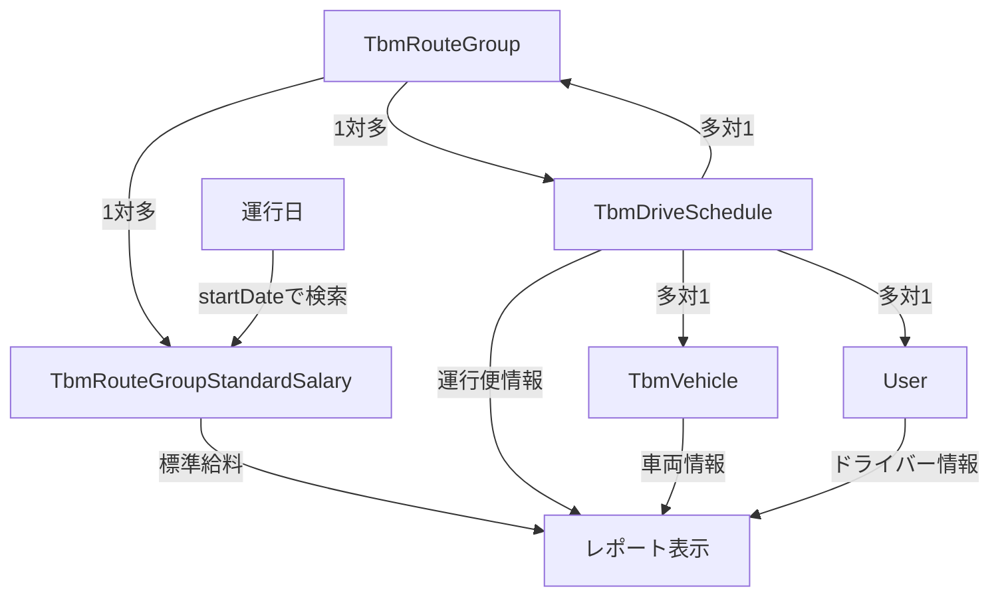

# tbm標準給料機能とレポートページ実装計画

## 概要

便ごとに「標準給料」を時期別に管理し、運行便をベースとして標準給料を含む情報を表示するレポートページを作成します。

## 実装内容

### 1. データベーススキーマ追加

#### 1.1 標準給料履歴管理テーブル作成

`prisma/schema/tbm.prisma` に新しいモデル `TbmRouteGroupStandardSalary` を追加：

```prisma
model TbmRouteGroupStandardSalary {
  id        Int       @id @default(autoincrement())
  createdAt DateTime  @default(now())
  updatedAt DateTime? @default(now()) @updatedAt()
  sortOrder Float     @default(0)

  startDate DateTime
  salary    Int?      // 標準給料（円）

  TbmRouteGroup   TbmRouteGroup @relation(fields: [tbmRouteGroupId], references: [id], onDelete: Cascade)
  tbmRouteGroupId Int

  @@index([tbmRouteGroupId, startDate])
}
```

- `TbmRouteGroup` にリレーション追加：`TbmRouteGroupStandardSalary TbmRouteGroupStandardSalary[]`
- `TbmRouteGroupFee` と同様の履歴管理パターンを採用（`startDate` で時期管理）

### 2. 標準給料設定機能

#### 2.1 便詳細ページへの標準給料設定UI追加

`src/app/(apps)/tbm/(builders)/PageBuilders/detailPage/TbmRouteGroupDetail.tsx` を拡張：

- 運賃設定（`TbmRouteGroupFee`）と同様のUIで標準給料を設定可能にする
- 履歴一覧表示と新規追加フォームを実装
- 開始日（`startDate`）と標準給料（`salary`）を入力

#### 2.2 標準給料取得ヘルパー関数作成

`src/app/(apps)/tbm/(class)/TbmReportCl/` 配下に新しいヘルパー関数を作成：

- `getStandardSalaryOnDate(tbmRouteGroupId: number, date: Date): number | null`
  - 指定日の時点で有効な標準給料を取得
  - `TbmRouteGroupFee` の取得ロジックと同様の実装

### 3. 運行便レポートページ作成

#### 3.1 ページファイル作成

`src/app/(apps)/tbm/(pages)/unkobinKyuyo/page.tsx` を作成：

- 既存のレポートページ（`unkomeisai/page.tsx`、`kyuyoSantei/page.tsx`）と同様の構造
- `NewDateSwitcher` で月切り替え
- `fetchUnkoBinKyuyoData` でデータ取得

#### 3.2 データ取得関数作成

`src/app/(apps)/tbm/(class)/TbmReportCl/fetchers/fetchUnkoBinKyuyoData.tsx` を作成：

- `TbmDriveSchedule` を取得（承認済み、指定月、指定営業所）
- 関連データを include：
  - `TbmRouteGroup`（標準給料履歴含む）
  - `TbmVehicle`
  - `User`
- 各運行便について、運行日の時点で有効な標準給料を取得

#### 3.3 レポート行生成関数作成

`src/app/(apps)/tbm/(class)/TbmReportCl/cols/createUnkoBinKyuyoRow.tsx` を作成：

表示項目：

- 運行日
- 便コード
- 便名
- 路線名
- 車番
- 車種
- ドライバー名
- ドライバーコード
- 標準給料（その時点での便の標準給料）

#### 3.4 クライアントコンポーネント作成

`src/app/(apps)/tbm/(pages)/unkobinKyuyo/UnkoBinKyuyoCC.tsx` を作成：

- `CsvTable` で一覧表示
- フィルター機能（便、車両、ドライバー）
- 既存の `UnkoMeisaiCC.tsx` を参考に実装

### 4. ナビゲーションメニュー追加

`src/non-common/getPages/getTbm_PAGES.tsx` を更新：

- レポート②メニュー配下に「運行便給与レポート」を追加
- URL: `/tbm/unkobinKyuyo`

### 5. マイグレーション

- Prismaスキーマ変更後、マイグレーションを実行
- `npx prisma migrate dev --name add_tbm_route_group_standard_salary`

## 実装ファイル一覧

### 新規作成

- `prisma/schema/tbm.prisma`（モデル追加）
- `src/app/(apps)/tbm/(pages)/unkobinKyuyo/page.tsx`
- `src/app/(apps)/tbm/(pages)/unkobinKyuyo/UnkoBinKyuyoCC.tsx`
- `src/app/(apps)/tbm/(class)/TbmReportCl/fetchers/fetchUnkoBinKyuyoData.tsx`
- `src/app/(apps)/tbm/(class)/TbmReportCl/cols/createUnkoBinKyuyoRow.tsx`

### 修正

- `prisma/schema/tbm.prisma`（`TbmRouteGroup` にリレーション追加）
- `src/app/(apps)/tbm/(builders)/PageBuilders/detailPage/TbmRouteGroupDetail.tsx`（標準給料設定UI追加）
- `src/non-common/getPages/getTbm_PAGES.tsx`（メニュー追加）

## データフロー



## 参考実装

- 運賃履歴管理: `TbmRouteGroupFee` モデルとその取得ロジック
- 運行明細レポート: `src/app/(apps)/tbm/(pages)/unkomeisai/`
- 給与算定レポート: `src/app/(apps)/tbm/(pages)/kyuyoSantei/`
- 便詳細ページ: `src/app/(apps)/tbm/(builders)/PageBuilders/detailPage/TbmRouteGroupDetail.tsx`