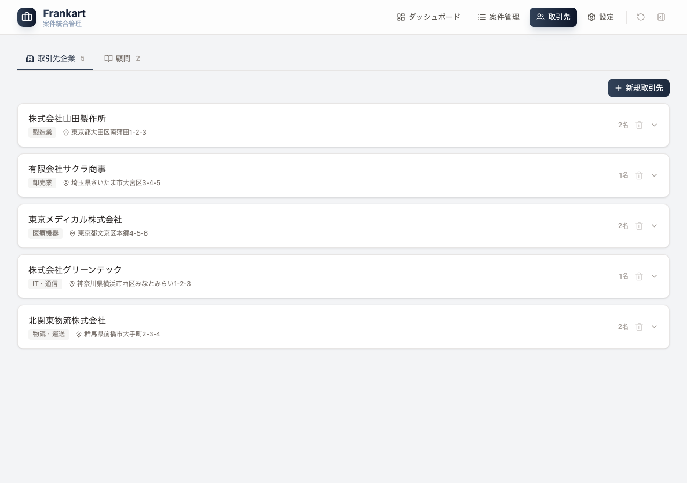
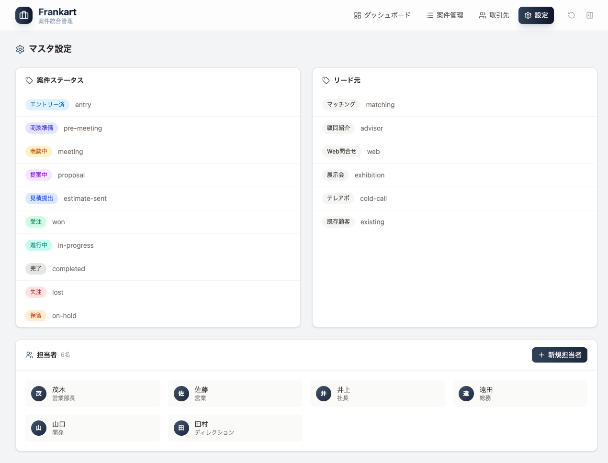
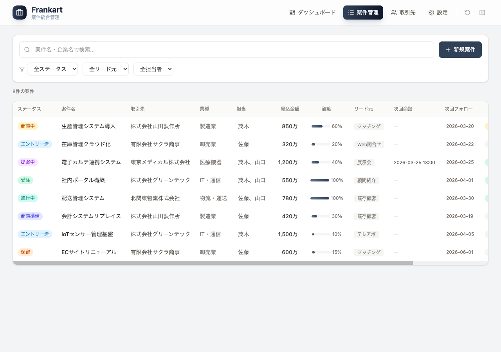
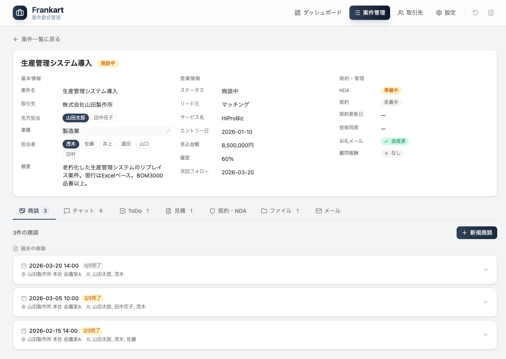
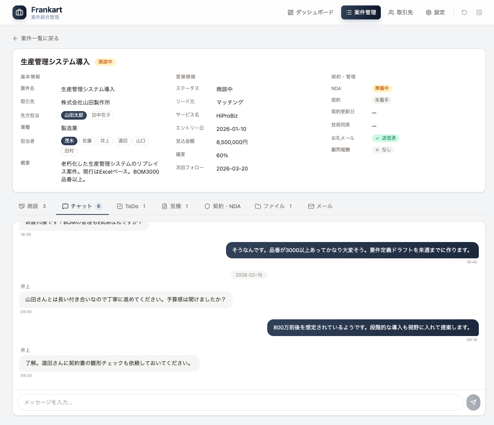
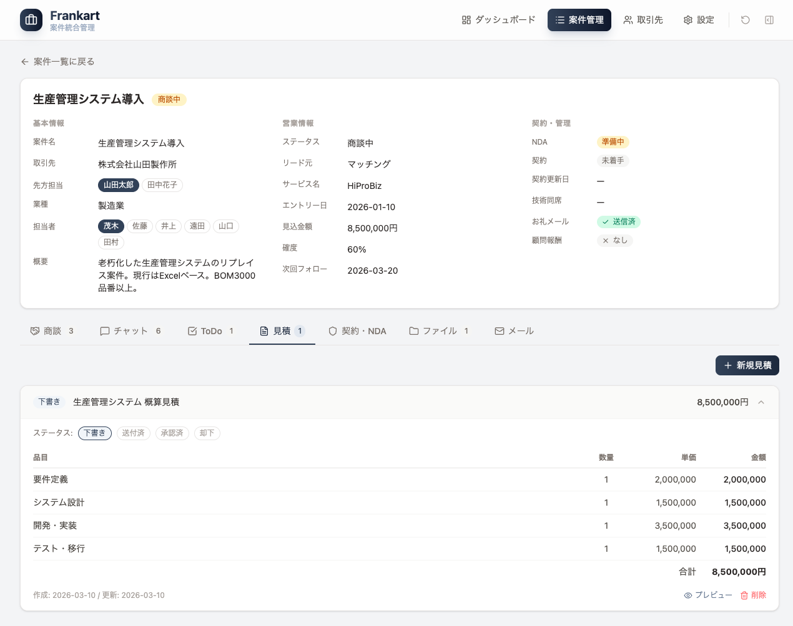
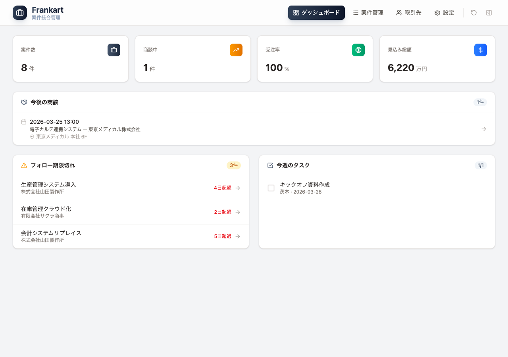

# 案件管理システム — ごデモ

## 目次

- [1. 本システムについて](#1-本システムについて)
- [2. 全体の流れ](#2-全体の流れ)
- [3. 事前設定](#3-事前設定)
- [4. 案件管理](#4-案件管理)
- [5. ダッシュボード](#5-ダッシュボード)

## 1. 本システムについて

### できること

案件管理システムは、**案件を基軸として営業活動を一元管理する**ためのシステムとして構想。

案件ごとに専用の「案件ルーム」が作られ、商談・チャット・見積・契約・ファイル・メールなど、案件に関わるすべての情報を1か所に集約できます。

| 機能（例）         | 説明                                           |
| ------------------ | ---------------------------------------------- |
| 案件管理           | 案件の発生から受注・完了まで、ステータスを追跡 |
| 商談管理           | 商談の記録、議事録、商談後業務のチェックリスト |
| チャット           | 案件ごとのチーム内メッセージング               |
| 見積作成           | 品目テーブルの入力、帳票プレビュー・印刷       |
| 契約・NDA          | テンプレートからの契約書・NDA自動生成          |
| ファイル共有       | 案件に紐づくファイルの一元管理                 |
| メールテンプレート | 各場面に応じたメール文面の自動生成             |
| 取引先管理         | 企業情報・担当者・顧問の管理                   |
| ダッシュボード     | KPI表示、フォロー期限切れアラート、タスク管理  |

> **注意：イメージ例です。実際の仕様・画面については今後の協議を元に詳細を検討します**

### 動作環境

| 項目           | 要件                           |
| -------------- | ------------------------------ |
| ブラウザ       | Google Chrome / Microsoft Edge |
| インターネット | 必要                           |
| ログイン       | メールアドレスとパスワード     |
| データ保存     | データベースに自動保存         |

---

## 2. 全体の流れ

```
① 事前設定
   取引先・担当者・マスタの登録
     ↓
② 案件管理
   案件の発生 → 商談 → 提案・見積 → 受注 → 進行・完了
   各種業務を案件ルームで一元管理
     ↓
③ ダッシュボード
   案件を横断して「必要な情報」へクイックアクセス
```

---

## 3. 事前設定

システムを使い始める前に、以下の初期データを登録します。

### 3-1. 取引先の登録

ヘッダーの **「取引先」** をクリックして、取引先管理画面を開きます。



**取引先企業タブ** と **顧問タブ** の2つがあります。

#### 取引先企業

- **「＋ 新規取引先」** ボタンで企業を追加
- 企業名、業種、住所、電話番号等を入力
- 企業カードを展開すると、**担当者（連絡先）** を追加・編集できます
  - 先方の担当者の氏名・役職・メール・電話等を登録

#### 顧問

- **「顧問」タブ** に切り替えて、営業顧問を登録
- 氏名、所属、電話、メール等を入力

### 3-2. マスタ設定（担当者の登録）

ヘッダーの **「設定」** をクリックして、マスタ設定画面を開きます。



#### 担当者

- **「＋ 新規担当者」** ボタンで自社の担当者を追加
- 氏名と役職を入力
- 登録した担当者は、案件の担当者割り当てやチャットで使用されます

#### 案件ステータス / リード元

- 案件のステータス（10段階）とリード元（6種類）が一覧表示されます（**区分は今後要検討**）
- これらはシステムに組み込み済みのため、確認用です

---

## 4. 案件管理

### 4-1. 案件一覧

ヘッダーの **「案件管理」** をクリックして、案件一覧画面を開きます。



#### 新規案件の追加

1. **「＋ 新規案件」** ボタンをクリック
2. 案件名、取引先、リード元、見込金額、担当者、説明を入力
3. 登録ボタンで案件が追加されます

#### 検索・フィルタ

- 上部の検索バーで **案件名・企業名** を検索
- **ステータス / リード元 / 担当者** のフィルタで絞り込み可能

### 4-2. 案件ルーム（案件詳細）

案件一覧で **案件名をクリック** すると、案件ルームが開きます。



案件ルームは、上部の **案件情報エリア** と、下部の **7つのタブ** で構成されます。（例）

#### 案件情報エリア（例）

| 基本情報 | 営業情報           | 契約・管理 |
| -------- | ------------------ | ---------- |
| 案件名   | ステータス         | NDA        |
| 取引先   | リード元           | 契約       |
| 先方担当 | サービス名         | 契約更新日 |
| 業種     | エントリー日       | 技術同席者 |
| 担当者   | 見込金額           | お礼メール |
| 概要     | 確度・次回フォロー | 顧問報酬   |

各項目はクリックして **その場で直接編集** できます。

#### タブ一覧

案件ルーム下部の7つのタブで、案件に関するすべての業務を管理します。

---

**商談タブ** — 商談の記録と管理

- 「＋ 新規商談」で商談を追加（日時・場所・参加者・アジェンダ）
- 商談カードを展開して **議事録** を入力
- **商談後チェックリスト**（議事録入力 / お礼メール / フォローアップ）で漏れを防止

---

**チャットタブ** — 案件内のチーム間メッセージ



- 案件に関する社内のやり取りを時系列で確認
- テキストを入力して送信（Enterキーでも送信可）

---

**ToDoタブ** — タスク管理

- 「＋ 追加」でタスクを登録（タスク名・担当者・期日）
- チェックボックスで完了・未完了を切り替え
- 未完了タスクが上に表示されます

---

**見積タブ** — 見積書の作成・管理



- 「＋ 新規見積」で見積を作成
- **品目テーブル**（品目名・数量・単価）を入力すると金額が自動計算
- ステータス管理：下書き → 送付済 → 承認済 / 却下
- **「プレビュー」** ボタンで正式な帳票形式の見積書を表示・印刷可能

---

**契約・NDAタブ** — 契約書類の管理

- **業務委託契約書** と **秘密保持契約書（NDA）** の2種類を管理
- 「テンプレートから作成」ボタンで、案件情報が自動差し込みされた書類を生成
- ステータス：未着手 → 準備中 → 送付済 → 締結済
- プレビュー・印刷が可能

  > **要注意:**
  > 契約書・NDAタブの「テンプレートから作成」機能は、シンプルなテンプレートだけで幅広い業務フローをカバーできるか、**業務や業界の特殊要件がないか要事前確認**が必要です。
  > たとえば「特定条件で条項追加」「発注先ごとにパターン分岐」「複数書類同時作成」などが発生する場合は、
  > **テンプレートエンジンや差し込みロジックのカスタマイズ**が別途必要になる場合があります。

- **契約書テンプレの事前ヒアリング推奨**
  - 欲しい文書パターンは何パターン必要か
  - 契約金額・期間・開始日などの自動差し込み項目一覧
  - パートナーによる条件分岐の要否
  - 電子契約サービス連携の要否

現状の機能は「案件情報の自動差し込み」＋「雛形選択」の想定。
自社独自の条文・項目追加など特殊要件がある場合は、実装前にテンプレ設計方針を決める必要があります。

---

**ファイルタブ** — 案件関連ファイルの管理

- 「＋ 登録」でファイルを追加（ファイル名・種別を選択）
- 種別：見積書 / 契約書 / NDA / 議事録 / 提案書 / その他

---

**メールタブ** — メールテンプレートの自動生成

案件情報を元に、各シーンに応じたメール文面を自動生成します。

| シーン              | 内容                             |
| ------------------- | -------------------------------- |
| エントリー応募      | マッチングサービスへの応募メール |
| 商談後お礼          | 翌営業日までに送るお礼メール     |
| フォローアップ      | 回答催促のリマインドメール       |
| 見積送付            | 見積書添付メール                 |
| 失注/保留後フォロー | 数か月後の状況確認メール         |
| 顧問への報告        | 営業顧問への案件結果報告メール   |

- シーンを選択すると、取引先名・担当者名・案件名・金額などが自動で差し込まれます
- 件名・本文は編集可能
- 「コピー」ボタンでクリップボードにコピーし、メールソフトに貼り付けて送信

---

## 5. ダッシュボード

ヘッダーの **「ダッシュボード」** をクリック（またはシステムを開いた初期画面）。



すべての案件を横断して、**今すぐ確認・対応が必要な情報** にクイックアクセスできます。

### KPIカード（上部）

| 指標       | 説明                   |
| ---------- | ---------------------- |
| 案件数     | 全案件の件数           |
| 商談中     | 現在商談中の案件数     |
| 受注率     | 受注した案件の割合     |
| 見込み総額 | 全案件の見込金額の合計 |

### 今後の商談

- 直近の商談予定を日時・案件名・場所付きで表示
- クリックすると該当の案件ルームへ直接遷移

### フォロー期限切れ

- 次回フォロー日を過ぎた案件を **超過日数付き** で警告表示
- クリックすると該当の案件ルームへ直接遷移

### 今週のタスク

- 全案件のタスクから、今週期限のものを抽出して表示
- チェックボックスで完了・未完了を切り替え可能

---

> 本デモは、デモ画面を元に作成しています。実際のシステムでは、お客様のご要望に合わせて機能のカスタマイズが可能です。
> ※本デモには、外部システム（SFA・会計・メール・カレンダー等）とのデータ連携や自動連携ワークフローは含まれていません。
> 実際の導入時に他システムとのAPI連携・データ連携をご希望の場合は、御社の業務要件・インフラ方針に応じて個別設計・実装いたします。
> 詳細は別途ご相談ください。
