# Regrow（月次業績レポートシステム） — ユーザーマニュアル

> **提供元**: Relaxation Salon SAMPLE 様向け
> **開発**: 合同会社 改善マニア
> **URL**: https://kaizen-mania.com/KM/mocks/regrow
> **最終更新**: 2026-03-11

---

## 目次

- [1. 本ツールについて](#1-本ツールについて)
- [2. 動作環境・初期設定](#2-動作環境初期設定)
- [3. 画面の見かた](#3-画面の見かた)
- [4. Excel取込](#4-excel取込)
- [5. データ確認](#5-データ確認)
- [6. 手動入力](#6-手動入力)
- [7. 目標売上](#7-目標売上)
- [8. スライド閲覧](#8-スライド閲覧)
- [9. マスタ管理](#9-マスタ管理)
- [10. 月次レポート作成の全体フロー](#10-月次レポート作成の全体フロー)

---

## 1. 本ツールについて

### できること

Regrowは、リラクゼーションサロンの**月次業績レポートを自動生成する**ためのシステムです。

毎月のExcel「担当者別分析表」と、手動入力するKPIデータを組み合わせて、**18枚のスライド資料**（グラフ・テーブル付き）を自動で作成します。

| 機能             | 説明                                                       |
| ---------------- | ---------------------------------------------------------- |
| Excelインポート  | 担当者別分析表を取り込み、スタッフの売上・客数等を自動抽出 |
| 手動データ入力   | 店舗KPI（稼働率・コメント等）やスタッフ個別データを入力    |
| 目標売上入力     | スタッフ別の月間目標売上を入力し、達成率を自動算出         |
| スライド資料閲覧 | 18枚構成のレポートスライドを自動生成・閲覧                 |
| マスタ管理       | 店舗・ユーザー・権限の管理                                 |
| 月別データ管理   | YYYY-MM単位でデータを管理し、過去月の閲覧・比較が可能      |

### 利用の流れ

```
① 新しい月を作成
  ↓
② 各店舗のExcelファイルをインポート
  ↓
③ 手動入力（スタッフ稼働率・CS登録数・コメント・お客様の声）
  ↓
④ 目標売上を入力
```

---

## 2. 動作環境・初期設定

### 動作環境

| 項目           | 要件                                                                 |
| -------------- | -------------------------------------------------------------------- |
| ブラウザ       | Google Chrome / Microsoft Edge / Safari（最新版推奨）                |
| インターネット | 必要                                                                 |
| ログイン       | メールアドレスとパスワード                                           |
| データ保存     | サーバーに自動保存（ブラウザのキャッシュ削除でもデータは消えません） |

### 用意するもの

| 書類                    | 必須 | 説明                                                                  |
| ----------------------- | ---- | --------------------------------------------------------------------- |
| 担当者別分析表（Excel） | 必須 | 業務システムから出力される .xlsx / .xls ファイル。店舗ごとに1ファイル |
| スタッフ稼働率          | 必須 | 各スタッフの月間稼働率（%）                                           |
| CS登録数                | 必須 | 各スタッフのCS登録件数                                                |
| お客様の声              | 任意 | お客様からのフィードバックテキスト                                    |
| スタッフ目標売上        | 任意 | スタッフ別の月間目標売上金額                                          |

### 権限（ロール）

| ロール           | 説明           | できること                           |
| ---------------- | -------------- | ------------------------------------ |
| 管理者（admin）  | システム管理者 | 全機能の操作、マスタ管理、データ編集 |
| 閲覧者（viewer） | 一般スタッフ   | スライドの閲覧のみ                   |

> 管理者のみがExcel取込・データ確認・手動入力・目標売上タブを操作できます。スライドタブは全ロールで閲覧可能です。

---

## 3. 画面の見かた

### 月選択バー

画面最上部に表示される月選択バーから、対象月の切り替えと新規作成を行います。

| 要素                      | 説明                         |
| ------------------------- | ---------------------------- |
| 対象月ドロップダウン      | 表示する対象月を切り替えます |
| **「+ 新規作成」** ボタン | 新しい月を作成します         |

### タブナビゲーション

月選択バーの下に、各機能タブが並びます。

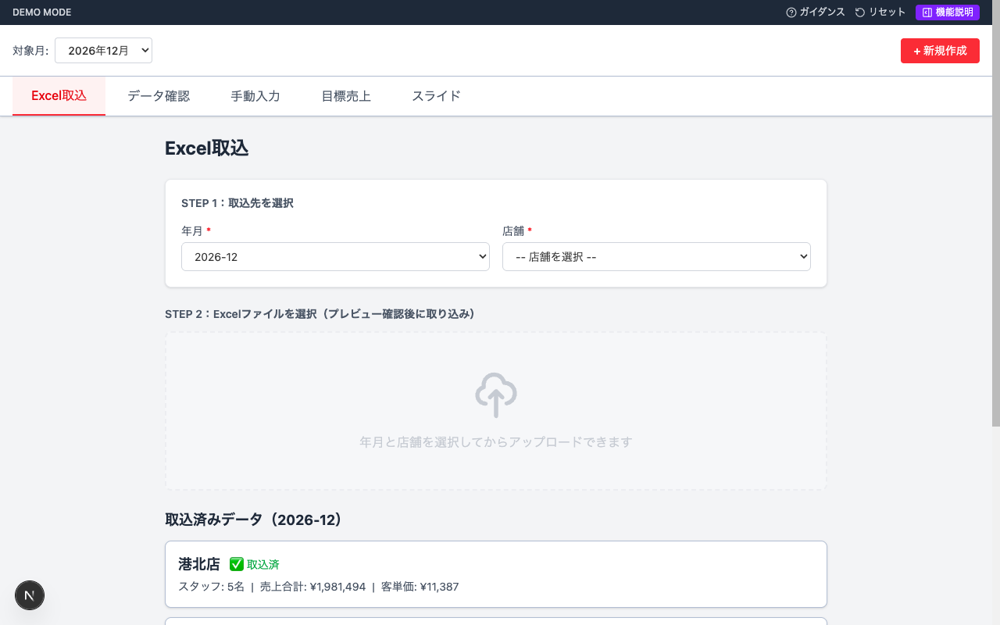

| タブ           | 説明                                    |
| -------------- | --------------------------------------- |
| **Excel取込**  | Excelファイルのアップロード             |
| **データ確認** | インポート済みデータの一覧表示          |
| **手動入力**   | 店舗KPI・スタッフ稼働率・CS登録数の入力 |
| **目標売上**   | スタッフ別目標売上の入力                |
| **スライド**   | 18枚のスライド資料を閲覧                |

---

## 4. Excel取込

Excelファイル（担当者別分析表）を取り込む画面です。


### 操作手順

1. **STEP 1** で取込先の **「年月」** と **「店舗」** をドロップダウンから選択します
2. **STEP 2** のエリアにExcelファイルをドラッグ＆ドロップ、またはクリックしてファイルを選択します
3. プレビュー画面が表示されるので、データ内容とスタッフのマッチング結果を確認します
4. 問題がなければ **「確認して取り込む」** ボタンをクリックします

### プレビュー画面の見かた

プレビューでは以下が表示されます。

- **取込先情報**: 選択した年月・店舗・集計期間
- **店舗合計**: 売上合計・対応客数・指名数・客単価
- **スタッフ一覧**: 各スタッフの売上データとマッチング状況

#### マッチング状態

| アイコン | 状態         | 説明                                                             |
| -------- | ------------ | ---------------------------------------------------------------- |
| ✅       | DB登録済     | ユーザー名と一致するユーザーが見つかった                         |
| ⚠️       | 未登録       | ユーザー名と一致するユーザーがいない。先にマスタ管理で登録が必要 |
| 🔄       | 同名ユーザー | 同じ名前のユーザーが複数いるため、ドロップダウンで選択が必要     |

### 取込済みデータの表示

画面下部に、現在の年月で取り込み済みの店舗がカードで表示されます。

| 表示項目                 | 説明                           |
| ------------------------ | ------------------------------ |
| 店舗名 + ✅ 取込済バッジ | 取込完了した店舗               |
| スタッフ数               | インポートされたスタッフの人数 |
| 売上合計                 | 店舗の月間売上合計             |
| 客単価                   | 店舗の平均客単価               |
| インポート日時           | 取込実行日時                   |

### 注意事項

- 同じ店舗・年月のデータを再度アップロードすると**上書き**されます
- 未登録スタッフがいる場合は、プレビュー画面から **「新規登録」** ボタンでその場で登録できます
- 対応ファイル形式: `.xlsx` / `.xls`

### Excelから抽出される項目

| 項目       | 説明               |
| ---------- | ------------------ |
| スタッフ名 | 担当者の氏名       |
| 売上合計   | スタッフの月間売上 |
| 新規客数   | 新規のお客様数     |
| 対応客数   | 対応した総客数     |
| 指名数     | 指名された件数     |
| 客単価     | 1人あたりの単価    |

---

## 5. データ確認

取り込んだExcelデータを店舗別に一覧表示する画面です。

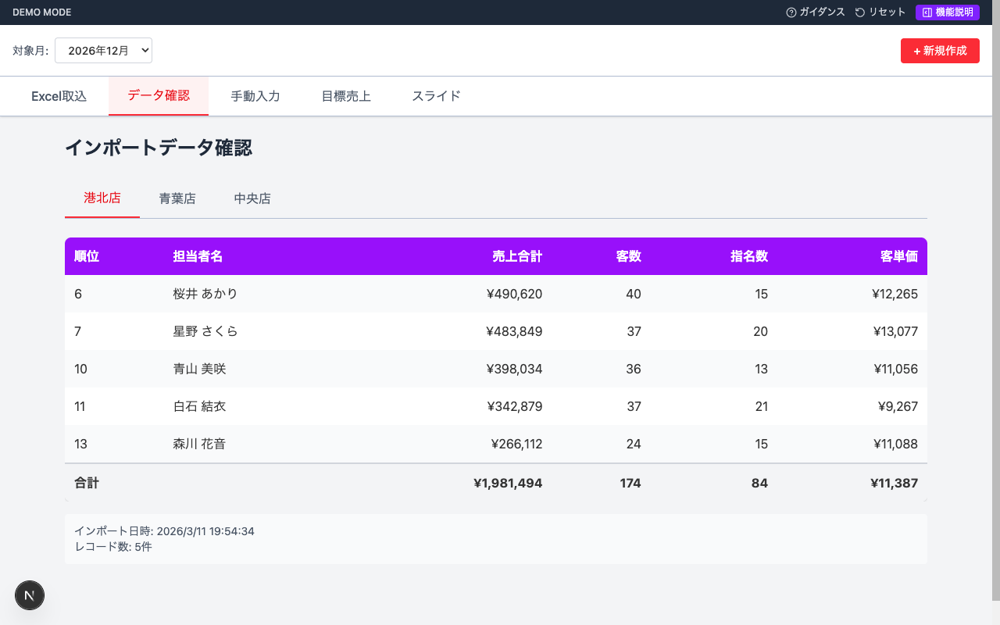

### 操作手順

1. 画面上部の **店舗タブ** で確認したい店舗を選択します
2. スタッフ一覧がランキング順で表示されます

### テーブルの列

| 列       | 説明                |
| -------- | ------------------- |
| 順位     | Excel上のランキング |
| 担当者名 | スタッフ名          |
| 売上合計 | 月間売上金額        |
| 客数     | 対応客数            |
| 指名数   | 指名件数            |
| 客単価   | 1人あたりの平均単価 |

- テーブル最下行に**店舗合計**が表示されます
- 画面下部にインポート日時とレコード数が確認できます
- 未取込の店舗タブには **「（未取込）」** と表示されます

> この画面は確認専用です。データの修正はできません。

---

## 6. 手動入力

Excelから自動取得できないデータを手動で入力する画面です。3つのサブタブに分かれています。

### 6.1 店舗KPIタブ

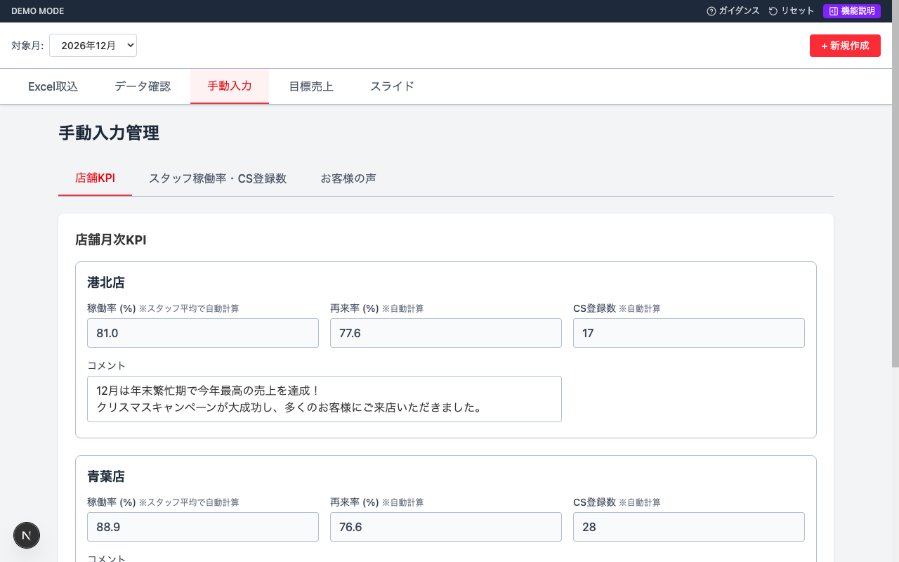

各店舗について以下が表示されます。

| 項目       | 入力/自動    | 説明                                               |
| ---------- | ------------ | -------------------------------------------------- |
| 稼働率 (%) | **自動計算** | スタッフ稼働率の平均値（編集不可）                 |
| 再来率 (%) | **自動計算** | (対応客数 − 新規客数) ÷ 対応客数 × 100（編集不可） |
| CS登録数   | **自動計算** | スタッフCS登録数の合計（編集不可）                 |
| コメント   | **手動入力** | 月次の店舗振り返りコメント                         |

> 稼働率・再来率・CS登録数は、次の「スタッフ稼働率・CS登録数」タブでスタッフ個別に入力すると自動で反映されます。

### 6.2 スタッフ稼働率・CS登録数タブ

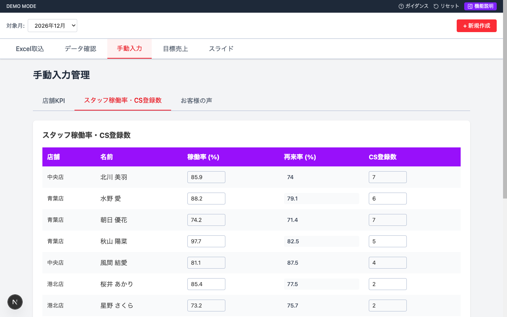

Excelをインポートすると、スタッフ一覧が自動で表示されます。

| 列         | 入力/自動    | 説明                                               |
| ---------- | ------------ | -------------------------------------------------- |
| 店舗       | 自動表示     | スタッフの所属店舗                                 |
| 名前       | 自動表示     | スタッフ名                                         |
| 稼働率 (%) | **手動入力** | スタッフ個人の月間稼働率                           |
| 再来率 (%) | **自動計算** | (対応客数 − 新規客数) ÷ 対応客数 × 100（編集不可） |
| CS登録数   | **手動入力** | スタッフのCS登録件数                               |

### 6.3 お客様の声タブ

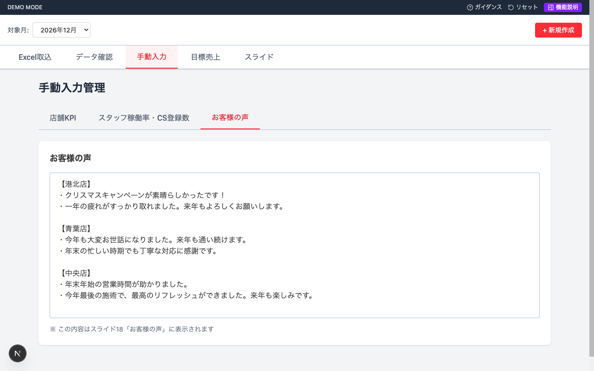

- テキストエリアにお客様からのフィードバックを自由に入力します
- この内容はスライド18「お客様の声」にそのまま反映されます

### 自動保存

- 入力欄からフォーカスが外れた時点で**自動保存**されます（保存ボタンはありません）
- データはデータベースに直接保存されます

### 自動計算の計算式

| 項目           | 計算式                                              |
| -------------- | --------------------------------------------------- |
| スタッフ再来率 | (対応客数 − 新規客数) ÷ 対応客数 × 100              |
| 店舗再来率     | 店舗内全スタッフの再来客数合計 ÷ 対応客数合計 × 100 |
| 店舗稼働率     | 店舗内全スタッフの稼働率の平均値                    |
| 店舗CS登録数   | 店舗内全スタッフのCS登録数の合計                    |

---

## 7. 目標売上

スタッフ別の月間目標売上を入力する画面です。入力された目標値はスライドの「売上目標達成率」に反映されます。

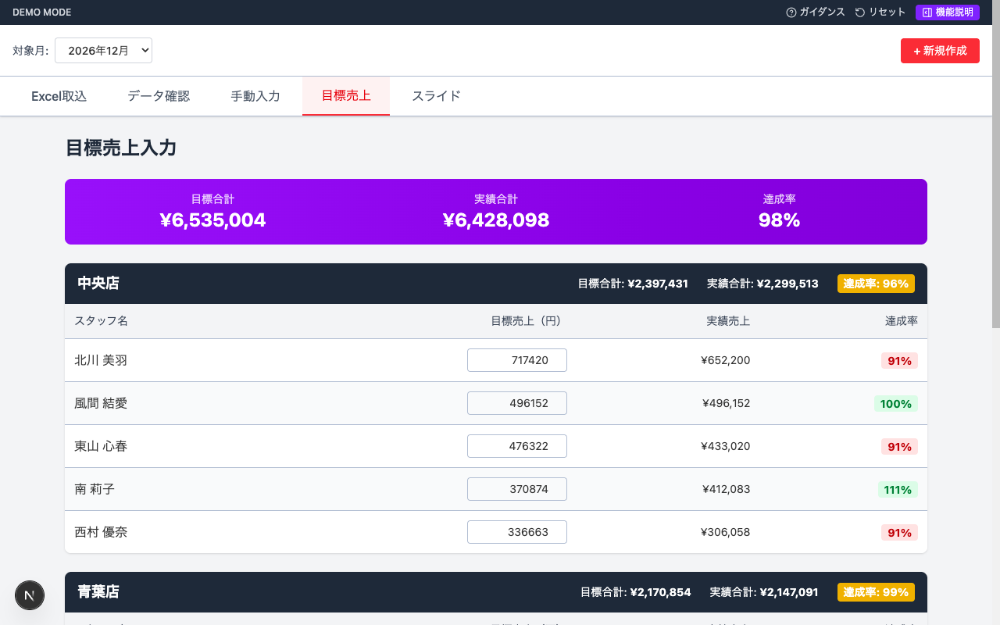

### 画面構成

#### 全体合計サマリー（画面上部・紫帯）

| 項目     | 説明                                          |
| -------- | --------------------------------------------- |
| 目標合計 | 全店舗の目標売上合計                          |
| 実績合計 | 全店舗の実績売上合計（Excelインポートデータ） |
| 達成率   | 実績合計 ÷ 目標合計 × 100                     |

#### 店舗別テーブル

各店舗がグループ分けされ、以下の情報が表示されます。

**店舗ヘッダー（黒帯）**:

- 店舗名、目標合計、実績合計、達成率バッジ

**スタッフ行**:

| 列             | 入力/自動    | 説明                                    |
| -------------- | ------------ | --------------------------------------- |
| スタッフ名     | 自動表示     | スタッフ名                              |
| 目標売上（円） | **手動入力** | 月間の目標売上金額                      |
| 実績売上       | **自動表示** | Excelインポートデータの売上（編集不可） |
| 達成率         | **自動計算** | 実績 ÷ 目標 × 100                       |

### 達成率の色分け

| 色  | 条件                 |
| --- | -------------------- |
| 緑  | 100%以上（目標達成） |
| 赤  | 100%未満（目標未達） |

### 自動保存

手動入力と同様に、フォーカスが外れた時点で自動保存されます。

---

## 8. スライド閲覧

ExcelデータとKPIデータから自動生成された18枚のスライド資料を閲覧する画面です。

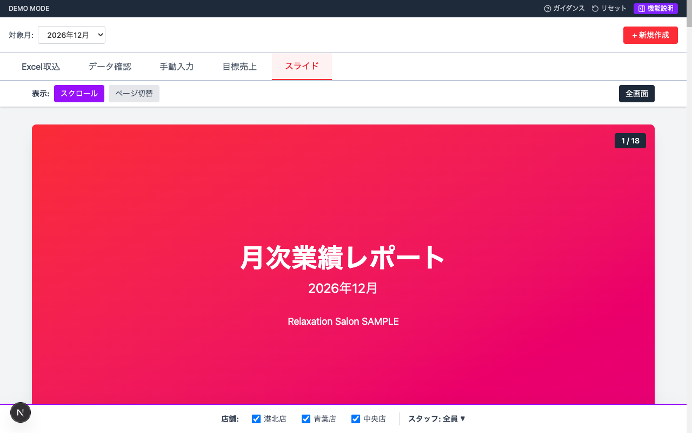

### スライド構成（全18枚）

| No. | タイトル                             | 内容                                                           |
| --- | ------------------------------------ | -------------------------------------------------------------- |
| 1   | タイトルスライド                     | 月次業績レポート、対象月の表示                                 |
| 2   | 目次                                 | レポートの構成一覧                                             |
| 3   | 全体サマリー                         | 店舗別KPIテーブル（売上/稼働率/客単価/再来率）+ 店舗コメント   |
| 4   | 客単価 - 年間推移                    | 店舗別の客単価を月別折れ線グラフで比較                         |
| 5   | 稼働率 - 年間推移                    | 店舗別の稼働率を月別折れ線グラフで比較                         |
| 6   | 再来率 - 年間推移                    | 店舗別の再来率を月別折れ線グラフで比較                         |
| 7   | 全指標統合 - 年間推移                | 客単価・稼働率・再来率を1つのグラフに統合表示                  |
| 8   | スタッフ別パフォーマンス             | スタッフ別テーブル（売上・稼働率・指名割合・再来率・CS登録率） |
| 9   | スタッフ稼働率チャート               | スタッフ稼働率の縦棒グラフ                                     |
| 10  | スタッフ別売上目標達成率（テーブル） | スタッフ別の目標売上・実績・差額・達成率テーブル               |
| 11  | スタッフ別売上目標達成率（グラフ）   | 目標vs実績の横棒グラフ + 達成率ライン                          |
| 12  | 店舗別売上目標達成率（テーブル）     | 店舗別の目標合計・実績合計・差額・達成率テーブル               |
| 13  | 店舗別売上目標達成率（グラフ）       | 目標vs実績の横棒グラフ + 達成率ライン                          |
| 14  | スタッフ別累計比較①（テーブル）      | 売上金額・指名件数の当月/累計平均/差分テーブル                 |
| 15  | スタッフ別累計比較①（グラフ）        | 売上（棒グラフ）+ 指名（折れ線）の複合グラフ                   |
| 16  | スタッフ別累計比較②（テーブル）      | 再来率・客単価の当月/累計平均/差分テーブル                     |
| 17  | スタッフ別累計比較②（グラフ）        | 客単価（棒グラフ）+ 再来率（折れ線）の複合グラフ               |
| 18  | お客様の声                           | 手動入力されたお客様のフィードバックを表示                     |

### スライド画面の例

#### 全体サマリー

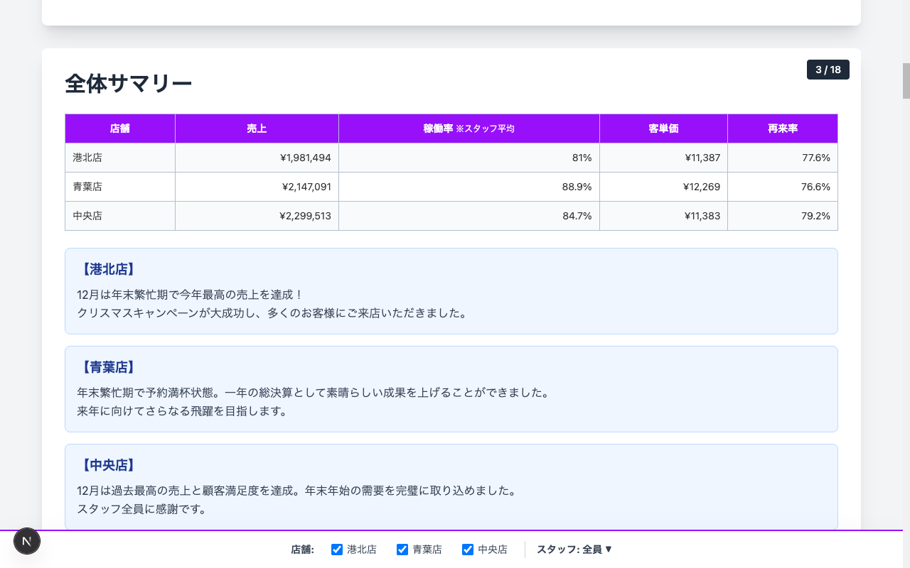

- 店舗別の売上・稼働率・客単価・再来率がテーブルで一覧表示されます
- 各店舗のコメント（手動入力で登録したもの）が下部に表示されます

#### スタッフ別パフォーマンス

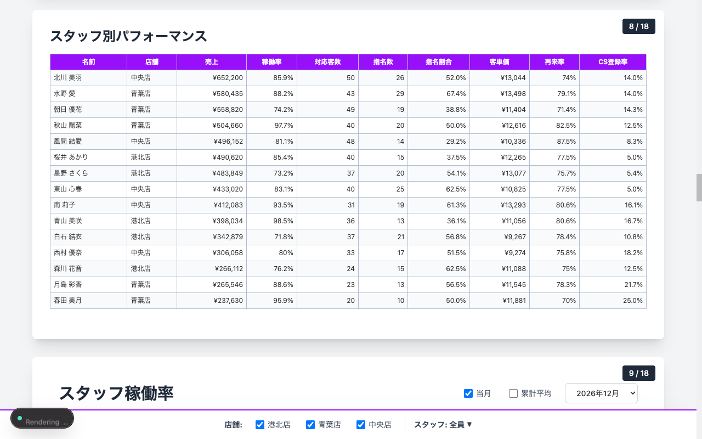

#### 売上目標達成率

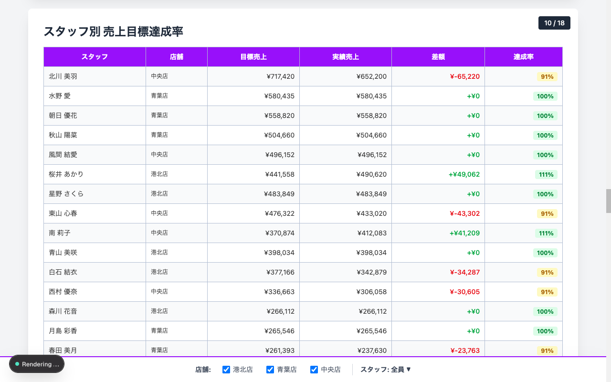

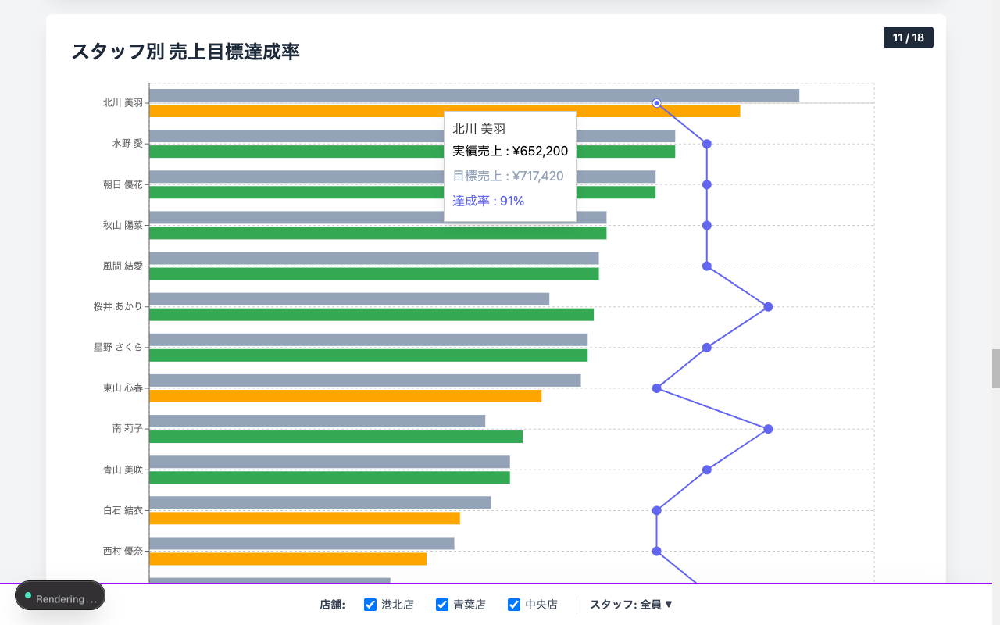

#### スタッフ別累計比較

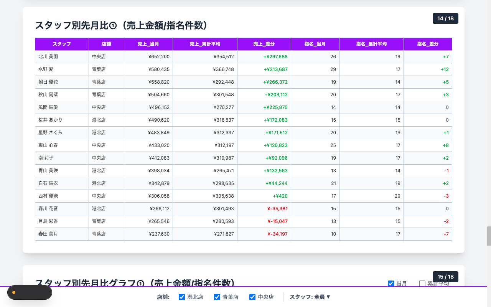

### 閲覧モード

画面上部のコントロールバーで閲覧モードを切り替えられます。

| モード     | 説明                                           |
| ---------- | ---------------------------------------------- |
| スクロール | 全18枚を縦に並べてスクロール表示（デフォルト） |
| ページ切替 | 1枚ずつ表示し、ボタンまたは矢印キーで前後移動  |

#### ページ切替モードの操作

| 操作                         | 動作                 |
| ---------------------------- | -------------------- |
| **「次へ」** ボタン / → キー | 次のスライドへ       |
| **「前へ」** ボタン / ← キー | 前のスライドへ       |
| **「全画面」** ボタン        | 全画面表示に切り替え |
| Escキー                      | 全画面を終了         |

### 店舗フィルタ

画面下部の店舗チェックボックスで、表示する店舗を絞り込めます。

- 複数店舗を同時に表示可能です
- チェックを外すと、その店舗とスタッフのデータが非表示になります

### スタッフフィルタ

**「スタッフ: 全員 ▼」** をクリックすると、表示するスタッフを選択できます。

- 店舗ごとにグルーピングされたチェックボックスで選択します
- スタッフ別のスライド（8～17）に適用されます

### 累計平均との比較

スライド14～17の累計比較では、チェックボックスで「当月」「累計平均」の表示を切り替えられます。

---

## 9. マスタ管理

### アクセス方法

サイドメニューから **「マスタ管理」** を選択します。管理者（admin）のみアクセス可能です。

### 9.1 店舗マスタ

店舗の登録・編集・削除を行います。

| 項目       | 必須 | 説明                                   |
| ---------- | ---- | -------------------------------------- |
| 名前       | 必須 | 店舗の略称（スライドに表示される名前） |
| フルネーム | 任意 | 店舗の正式名称                         |
| 有効/無効  | -    | 無効にすると各画面で非表示になります   |

#### 操作

- **「新規追加」** ボタンで新しい店舗を登録
- 各行の鉛筆アイコンで編集
- 各行のゴミ箱アイコンで削除

### 9.2 ユーザー・権限管理

ユーザーの登録・担当店舗の割当・有効/無効の管理を行います。

| 項目           | 必須 | 説明                                                |
| -------------- | ---- | --------------------------------------------------- |
| 名前           | 必須 | ユーザーの表示名（Excel上のスタッフ名と一致させる） |
| メールアドレス | 任意 | ログイン用                                          |
| パスワード     | 任意 | ログイン用                                          |

> **重要**: ユーザー名はExcelインポート時のスタッフ名マッチングに使用されます。Excelの担当者名と**完全一致**する名前で登録してください。

#### 操作

- **「新規追加」** ボタンでユーザーを登録
- **担当店舗ドロップダウン** で所属店舗を設定（即時反映）
- **有効/無効スイッチ** で状態を切り替え（無効ユーザーはマッチング対象外）
- ゴミ箱アイコンで削除

> 退職者は「無効」にすることを推奨します。削除すると、過去データのスタッフ紐付けが解除されます。

### 9.3 権限割当

権限割当テーブルで、各ユーザーにロール（admin / viewer）を設定します。

---

## 10. 月次レポート作成の全体フロー

毎月のレポート作成は以下の手順で行います。

| 手順                | 操作                                                 | 完了条件                         |
| ------------------- | ---------------------------------------------------- | -------------------------------- |
| ① 新しい月を作成    | 月選択バーの **「+ 新規作成」** ボタンから年月を入力 | 月が一覧に追加される             |
| ② Excelをインポート | 各店舗の担当者別分析表をアップロード                 | 全店舗分のデータがインポート済み |
| ③ 手動入力          | スタッフ稼働率・CS登録数・コメント・お客様の声を入力 | 全店舗・全スタッフ分の入力完了   |
| ④ 目標売上を入力    | スタッフ別の月間目標売上を入力                       | 全スタッフの目標値を設定         |
| ⑤ スライドを確認    | スライドタブで18枚を閲覧                             | データに問題がないことを確認     |

> 手動入力が未完了の場合、タブに赤い **「!」** バッジが表示されます。

---
