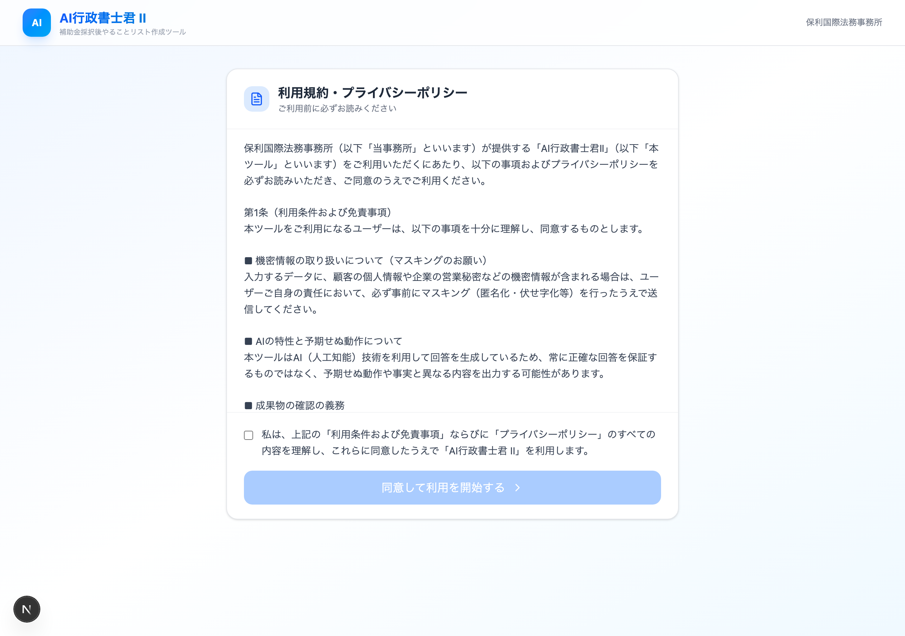
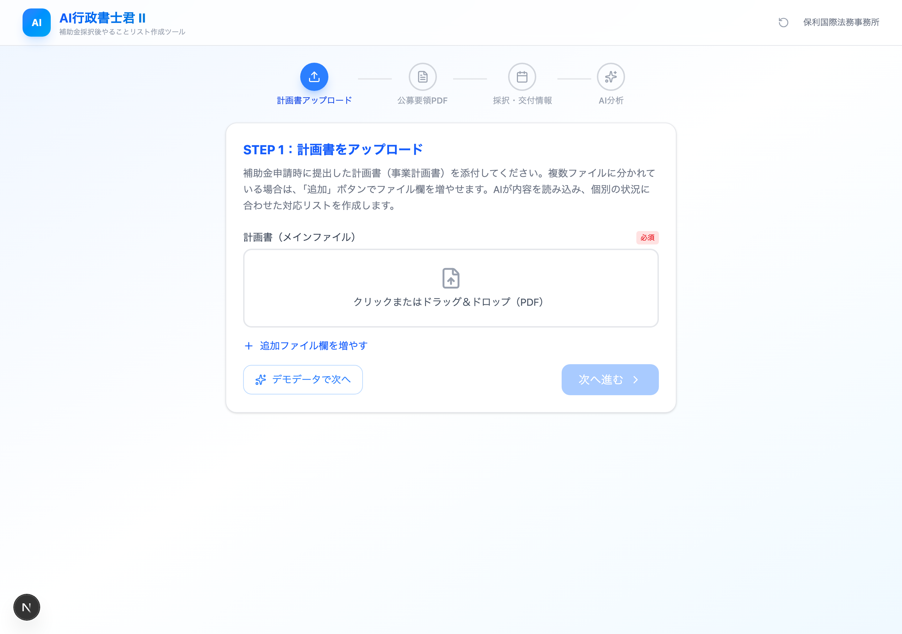
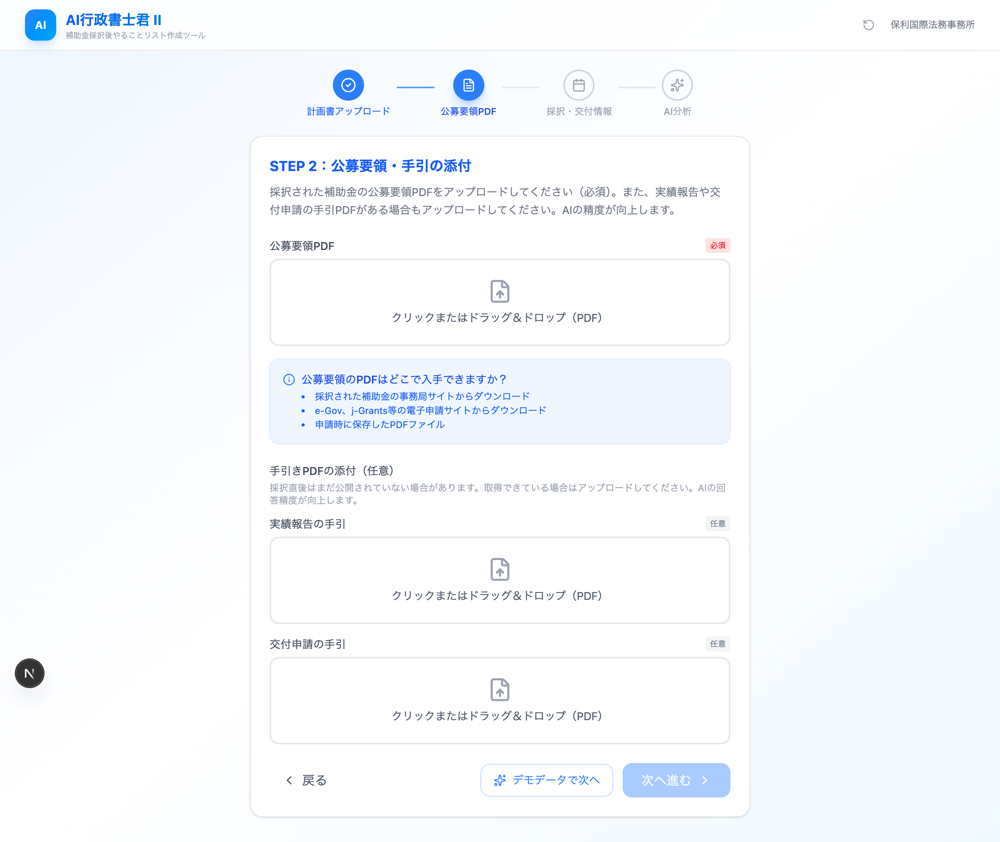
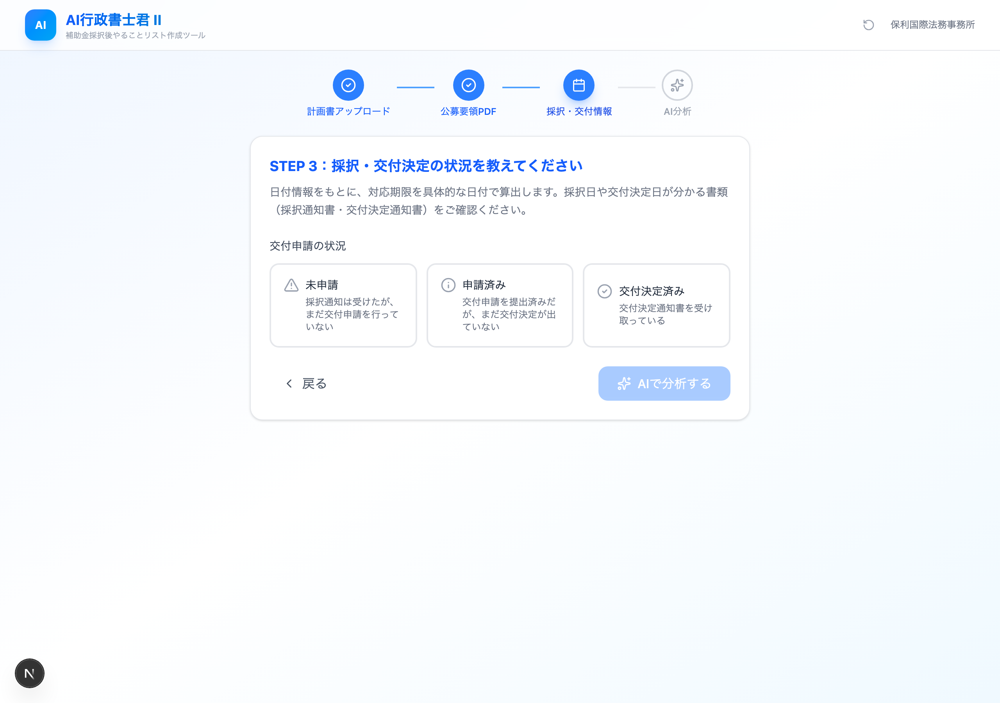
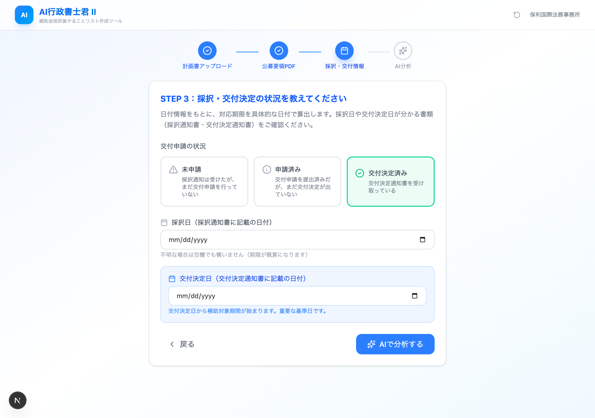
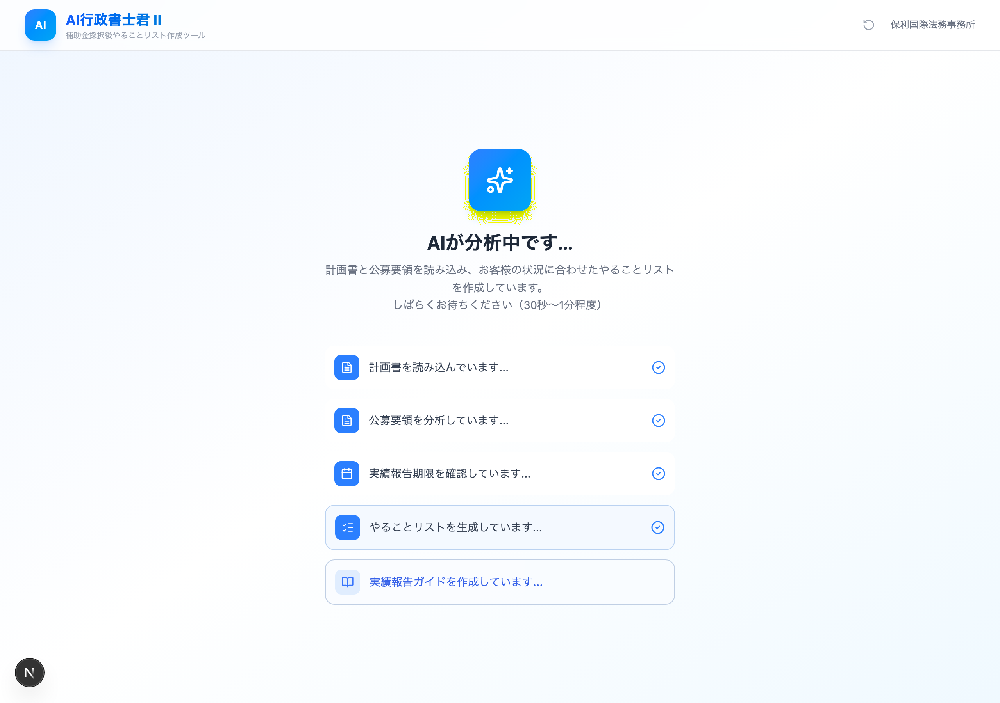
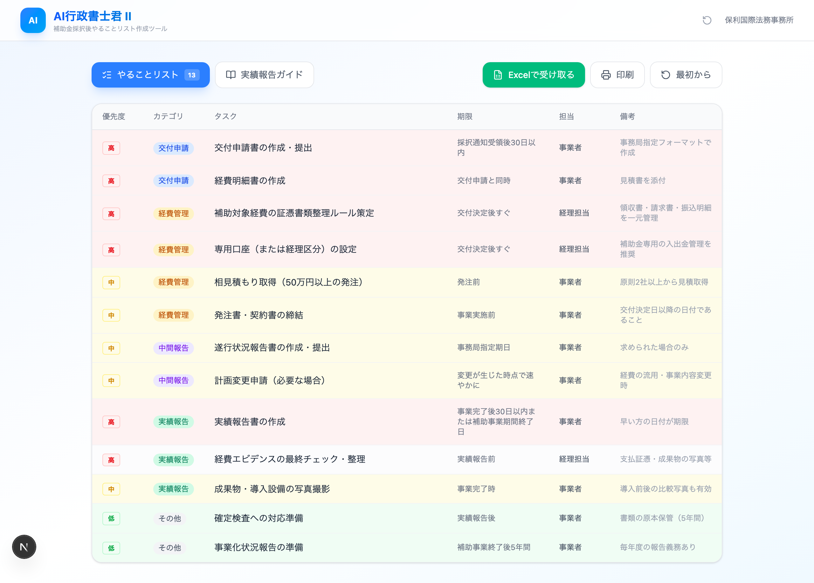

# AI行政書士くん II — ユーザーマニュアル

> **提供元**: 保利国際法務事務所
> **開発**: 合同会社改善マニア
> **URL**: https://kaizen-mania.com/KM/mocks/gyosei
> **最終更新**: 2026-03-11

---

## 目次

1. [本ツールについて](#1-本ツールについて)
2. [初期設定・動作環境](#2-初期設定動作環境)
3. [利用規約への同意（初回のみ）](#3-利用規約への同意初回のみ)
4. [STEP 1: 計画書のアップロード](#4-step-1-計画書のアップロード)
5. [STEP 2: 公募要領・手引の添付](#5-step-2-公募要領手引の添付)
6. [STEP 3: 採択・交付決定の状況入力](#6-step-3-採択交付決定の状況入力)
7. [AI分析の実行](#7-ai分析の実行)
8. [分析結果の確認](#8-分析結果の確認)
9. [Excelファイルの受け取り](#9-excelファイルの受け取り)
10. [印刷・PDF保存](#10-印刷pdf保存)
11. [データのリセット](#11-データのリセット)
12. [利用制限について](#12-利用制限について)
13. [デモモードの使い方](#13-デモモードの使い方)
14. [よくあるご質問（FAQ）](#14-よくあるご質問faq)

---

## 1. 本ツールについて

「AI行政書士くん II」は、**補助金に採択された事業者様**が「採択後に何をすればよいか」を把握するためのAIツールです。

### できること

- 事業計画書と公募要領をAIが読み取り、**やることリスト**（約20件のタスク）を自動生成
- 各タスクに**優先度・期限・担当者・カテゴリ**を自動付与
- 結果を**Excelファイル**としてメールで受け取り可能
- **印刷・PDF保存**にも対応

### 利用の流れ

```
利用規約に同意 → STEP1（計画書） → STEP2（公募要領） → STEP3（採択状況） → AI分析 → 結果表示
```

---

## 2. 初期設定・動作環境

### 動作環境

| 項目           | 要件                                                             |
| -------------- | ---------------------------------------------------------------- |
| ブラウザ       | Google Chrome / Edge / Safari（最新版推奨）                      |
| インターネット | 必須（AI分析時にサーバーと通信）                                 |
| ログイン       | **不要**（どなたでもアクセス可能）                               |
| データ保存     | ブラウザのlocalStorage（端末に保存、サーバーには送信されません） |

### 初期設定

特別な初期設定は不要です。上記URLにアクセスするだけでご利用いただけます。

### 用意するもの

| 書類              | 必須/任意 | 説明                                         |
| ----------------- | --------- | -------------------------------------------- |
| 事業計画書PDF     | **必須**  | 補助金申請時に提出した計画書（事業計画書）   |
| 公募要領PDF       | **必須**  | 採択された補助金の公募要領                   |
| 実績報告の手引PDF | 任意      | あればAIの精度が向上                         |
| 交付申請の手引PDF | 任意      | あればAIの精度が向上                         |
| 採択通知書        | 参照用    | 採択日の確認に使用                           |
| 交付決定通知書    | 参照用    | 交付決定日の確認に使用（交付決定済みの場合） |

---

## 3. 利用規約への同意（初回のみ）

初回アクセス時に、利用規約・プライバシーポリシーの同意画面が表示されます。



### 操作手順

1. **利用規約を最後までスクロール**します
   - スクロールが完了すると、緑色のバナー「最後まで読んでいただきありがとうございました」が表示されます
2. **チェックボックスにチェック**を入れます
   - 「私は、上記の『利用条件および免責事項』ならびに『プライバシーポリシー』のすべての内容を理解し、これらに同意したうえで『AI行政書士君 II』を利用します。」
3. **「同意して利用を開始する →」ボタン**をクリックします

### 注意事項

- 利用規約を最後までスクロールしないとチェックボックスが有効になりません
- 同意状態はブラウザに保存されるため、同じ端末・同じブラウザでは次回以降は表示されません
- ブラウザのデータを消去すると再度表示されます

### 利用規約の主なポイント

| 条項                 | 内容                                                                       |
| -------------------- | -------------------------------------------------------------------------- |
| 機密情報のマスキング | 個人情報や営業秘密は事前に伏せ字化してからアップロードしてください         |
| AIの特性             | 常に正確な回答を保証するものではありません                                 |
| 成果物の確認義務     | 生成された情報は参考情報です。実際の手続きには専門家の確認を受けてください |
| 免責事項             | 本ツールの利用に起因する損害について当事務所は責任を負いません             |

---

## 4. STEP 1: 計画書のアップロード

補助金申請時に提出した事業計画書（PDF）をアップロードします。



### 操作手順

1. **「計画書（メインファイル）」のアップロードエリア**をクリック、またはPDFファイルをドラッグ＆ドロップします
   - 「クリックまたはドラッグ＆ドロップ（PDF）」と表示されているエリアです
   - 赤い「必須」バッジが付いています
2. ファイル選択ダイアログでPDFファイルを選択します
3. アップロードが完了すると、ファイル名が青色で表示されます

### 追加ファイルのアップロード（任意）

計画書が複数ファイルに分かれている場合：

1. **「追加ファイル欄を増やす」リンク**をクリックします
2. 新しいアップロードエリア（点線枠）が追加されます
3. 同様の操作でPDFをアップロードします
4. 不要な追加欄は右上の「×」ボタンで削除できます

### ファイル要件

| 項目           | 制限                        |
| -------------- | --------------------------- |
| ファイル形式   | PDF のみ                    |
| ファイルサイズ | 1ファイルあたり最大 **5MB** |
| メインファイル | **必須**（1ファイル）       |
| 追加ファイル   | 任意（個数制限なし）        |

### アップロード済みファイルの削除

- ファイル名の右にある「×」ボタンをクリックすると削除できます

### 次のステップへ

- **「次へ進む」ボタン**をクリックします
  - メインファイルがアップロードされていないとボタンが無効（グレー）になります

---

## 5. STEP 2: 公募要領・手引の添付

採択された補助金の公募要領PDFをアップロードします。



### 操作手順

1. **「公募要領PDF」のアップロードエリア**をクリック、またはPDFをドラッグ＆ドロップします
   - 赤い「必須」バッジが付いています
2. ファイル選択ダイアログでPDFを選択します

### 公募要領PDFの入手先

画面内に青色のヒントボックスが表示されています：

- 採択された補助金の**事務局サイト**からダウンロード
- **e-Gov、j-Grants等**の電子申請サイトからダウンロード
- 申請時に保存した**PDFファイル**

### 手引PDFの添付（任意）

精度向上のために、以下の手引PDFも添付できます：

| ファイル       | 説明                           |
| -------------- | ------------------------------ |
| 実績報告の手引 | 実績報告の手続きに関する手引書 |
| 交付申請の手引 | 交付申請の手続きに関する手引書 |

> 採択直後はまだ公開されていない場合があります。取得できた時点でアップロードしてください。

### ナビゲーション

- **「← 戻る」**: STEP 1 に戻ります（アップロード済みデータは保持されます）
- **「次へ進む」**: STEP 3 に進みます（公募要領PDFがアップロードされていないとボタンが無効）

---

## 6. STEP 3: 採択・交付決定の状況入力

補助金の採択・交付決定の状況と日付を入力します。この情報をもとに、AIが具体的な期限を算出します。



#### 交付決定済みを選択した場合



### 操作手順

#### 6-1. 交付申請の状況を選択（必須）

3つの選択肢から現在の状況を選びます：

| 選択肢           | 説明                                             | 色   |
| ---------------- | ------------------------------------------------ | ---- |
| **未申請**       | 採択通知は受けたが、まだ交付申請を行っていない   | 黄色 |
| **申請済み**     | 交付申請を提出済みだが、まだ交付決定が出ていない | 青色 |
| **交付決定済み** | 交付決定通知書を受け取っている                   | 緑色 |

#### 6-2. 採択日の入力

- カレンダーから採択日（採択通知書に記載の日付）を選択します
- 不明な場合は空欄でも構いません（期限が概算になります）

#### 6-3. 交付決定日の入力（交付決定済みの場合のみ）

- 「交付決定済み」を選択した場合のみ表示されます
- 交付決定通知書に記載の日付を入力します
- 交付決定日から補助対象期間が始まるため、重要な基準日です

### 状況別の注意メッセージ

**「未申請」を選択した場合:**

<!-- 未申請選択時は採択日入力フィールドのみ表示され、交付決定日入力は非表示になります -->

> 交付申請がまだの場合、採択されても交付決定を受けるまでは補助対象経費の発注・契約・支出ができません。AIは交付申請に必要な手続きを優先的にリストアップします。

**「申請済み」を選択した場合:**

> 交付決定が出るまでの間に準備できることをリストアップします。交付決定後にすぐ事業を開始できるよう、事前準備を進めましょう。

### AI分析の開始

- 「**AIで分析する**」ボタンをクリックします
- 交付申請の状況が未選択の場合、ボタンは無効です

---

## 7. AI分析の実行

「AIで分析する」ボタンを押すと、AI分析が開始されます。



### 分析中の画面

分析中は以下のプログレスステップが順次表示されます：

| ステップ | 内容                              |
| -------- | --------------------------------- |
| 1        | 計画書を読み込んでいます...       |
| 2        | 公募要領を分析しています...       |
| 3        | 実績報告期限を確認しています...   |
| 4        | やることリストを生成しています... |

### 所要時間

- 通常 **30秒〜1分程度** かかります
- PDFのサイズやページ数が多い場合はさらに時間がかかることがあります
- 画面を閉じずにお待ちください

### エラーが発生した場合

ネットワーク接続の問題等でエラーが発生した場合：

- エラーメッセージが表示されます
- 「最初からやり直す」ボタンでリセットできます

---

## 8. 分析結果の確認

AI分析が完了すると、結果表示画面に切り替わります。



### 8-1. やることリストタブ

デフォルトで表示されるタブです。約20件のタスクがテーブル形式で表示されます。

| カラム       | 内容                                               |
| ------------ | -------------------------------------------------- |
| **優先度**   | 高（赤）/ 中（黄）/ 低（緑）                       |
| **カテゴリ** | 交付申請 / 経費管理 / 中間報告 / 実績報告 / その他 |
| **タスク**   | 具体的なタスク名称                                 |
| **期限**     | 目安の期限（採択日・交付決定日基準で算出）         |
| **担当**     | 事業者 / 経理担当 等                               |
| **備考**     | 注意点や補足情報                                   |

#### カテゴリの色分け

| カテゴリ | 色     |
| -------- | ------ |
| 交付申請 | 青     |
| 経費管理 | 黄     |
| 中間報告 | 紫     |
| 実績報告 | 緑     |
| その他   | グレー |

### 8-2. 操作ボタン

結果画面の上部に以下のボタンがあります：

| ボタン              | 機能                                                              |
| ------------------- | ----------------------------------------------------------------- |
| **やることリスト**  | やることリストタブに切替（件数バッジ付き）                        |
| **Excelで受け取る** | Excelファイルをメールで受信（→[9章](#9-excelファイルの受け取り)） |
| **印刷**            | ブラウザの印刷機能を起動（→[10章](#10-印刷pdf保存)）              |
| **最初から**        | データをリセットして最初からやり直す                              |

---

## 9. Excelファイルの受け取り

やることリストをExcelファイルとしてメールで受け取ることができます。

### 操作手順

1. 結果画面の「**Excelで受け取る**」ボタン（緑色）をクリックします
2. メールアドレス入力欄が表示されます
3. メールアドレスを入力し、「**送信する**」ボタンをクリック（またはEnterキー）
4. 「送信しました！メールをご確認ください。」と表示されれば完了です

### Excelファイルの構成

| シート                | 内容                                                             |
| --------------------- | ---------------------------------------------------------------- |
| 1枚目: 事務所紹介     | 保利国際法務事務所の説明                                         |
| 2枚目: やることリスト | AI生成タスク一覧（カテゴリ・タスク・期限・担当者・優先度・備考） |

### 注意事項

- 有効なメールアドレスを入力してください（形式チェックあり）
- 入力欄右の「×」ボタンで入力欄を閉じることができます

---

## 10. 印刷・PDF保存

### 操作手順

1. 結果画面の「**印刷**」ボタンをクリックします
2. ブラウザの印刷ダイアログが表示されます
3. プリンターを選択して印刷、または「PDFとして保存」を選択してPDF出力

---

## 11. データのリセット

### リセット方法

- ヘッダー右上の「↻」（リセット）アイコンをクリックします
- または結果画面の「**最初から**」ボタンをクリックします
- 確認ダイアログが表示されるので「OK」をクリックします

### リセットされるデータ

- 利用規約の同意状態
- アップロードしたファイル情報
- 入力した採択日・交付決定日
- AI分析の結果
- すべてのステップの進捗

---

## 12. 利用制限について

| 項目     | 内容                                    |
| -------- | --------------------------------------- |
| 制限回数 | 同一端末・同一ブラウザで **1日2回まで** |
| リセット | 日付が変わると回数がリセットされます    |
| 判定方法 | ブラウザのlocalStorageで管理            |

- 制限に達した場合、翌日に再度ご利用いただけます
- 別のブラウザや端末を使用することで回避可能です

---

## 13. デモモードの使い方

ファイルをアップロードせずに全機能を体験できるデモモードがあります。

### 操作方法

1. **STEP 1** の画面で「**デモデータで次へ**」ボタンをクリック
   - ダミーの計画書データが設定され、STEP 2 に進みます
2. **STEP 2** の画面で「**デモデータで次へ**」ボタンをクリック
   - ダミーの公募要領データが設定され、STEP 3 に進みます
3. STEP 3 で交付申請の状況を選択し、「AIで分析する」をクリック
4. デモ用のサンプル結果（13件のタスクリスト）が表示されます

> デモモードではAI分析の待ち時間が通常より短くなります（約3秒）。

---

## 14. よくあるご質問（FAQ）

### Q. アップロードしたPDFはサーバーに保存されますか？

A. PDFデータはAI分析時にGemini APIへ送信されますが、分析後に保存されることはありません。ブラウザのlocalStorageに一時保存されるデータは端末のブラウザ内のみに存在します。

### Q. 途中で画面を閉じてしまった場合は？

A. 入力データはブラウザのlocalStorageに自動保存されています。同じ端末・同じブラウザで再度アクセスすれば、前回の続きから再開できます。

### Q. 「次へ進む」ボタンが押せません

A. 必須項目（赤い「必須」バッジのあるファイル）がアップロードされていることを確認してください。

### Q. PDFのアップロードでエラーが出ます

A. 以下を確認してください：

- ファイル形式がPDFであること（.pdf）
- ファイルサイズが5MB以下であること
- 破損していないPDFファイルであること

### Q. AI分析が長時間終わりません

A. 通常30秒〜1分程度です。2分以上経過する場合はネットワーク接続を確認し、ページを再読み込みしてやり直してください。

### Q. 結果の内容が正確でないように感じます

A. 本ツールはAI（Gemini 2.5 Flash）により生成されるため、常に正確な情報を保証するものではありません。実際の手続きについては必ず事務局や専門家にご確認ください。

---

## 技術仕様

| 項目           | 内容                                     |
| -------------- | ---------------------------------------- |
| AIモデル       | Gemini 2.5 Flash                         |
| パラメータ     | maxOutputTokens: 16384, temperature: 0.3 |
| データ保存     | localStorage（サーバー側DB不使用）       |
| フレームワーク | Next.js App Router（Server Actions）     |
| Excel生成      | exceljs（サーバーサイド）                |

---

## お問い合わせ先

保利国際法務事務所
〒815-0037 福岡県福岡市南区玉川町13-3
TEL: 050-5526-5506
