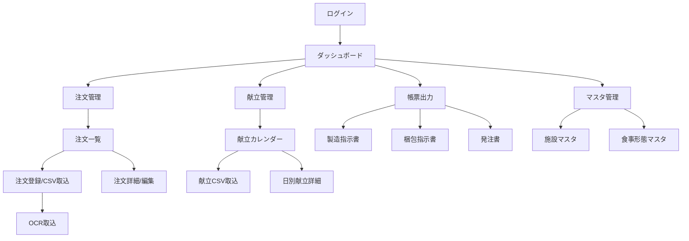

# 介護食管理システム アプリ設計書

作成日: 2026-01-29
バージョン: 1.0

---

## 1. プロジェクト概要

### 1.1 目的

複数の介護施設からの日々の食事注文（食数）を取り込み、献立マスタに基づき「製造総重量」「梱包内訳」「原材料発注量」を自動計算・出力する。これにより、手作業での計算ミスを防ぎ、製造・配送・発注業務を効率化する。

### 1.2 対象ユーザー

| ユーザー | 役割 | 主な操作 |
|---------|------|---------|
| システム管理者 | 献立・マスタ管理 | 献立CSV取込、原材料編集、ユーザー管理 |
| 一般ユーザー（製造担当） | 日常業務 | 注文入力、計算実行、帳票出力 |

### 1.3 スコープ

**今回の開発範囲:**
- 献立CSVデータの取込・管理
- 施設からの注文データ取込（CSV/AI-OCR）
- 製造量・発注量の自動計算
- 製造指示書・梱包指示書・発注書の出力

**対象外（将来検討）:**
- モバイルアプリ対応
- リアルタイム在庫管理
- 配送ルート最適化

---

## 2. データモデル

### 2.1 献立データの階層構造

献立データは以下の5階層で管理する。

```
┌─────────────────────────────────────────────────────┐
│ KgDailyMenu (日付)                                  │
│   └─ KgMealSlot (Category: 朝食、昼食、昼間食、夕食)│
│       └─ KgMenuRecipe (Menu: 献立)                  │
│           └─ KgMenuRecipe (Dish: 料理)              │
│               └─ KgRecipeIngredient (材料)          │
└─────────────────────────────────────────────────────┘
```

- **Menu（献立）**: `parentRecipeId = null` の `KgMenuRecipe`
- **Dish（料理）**: `parentRecipeId = Menu.id` の `KgMenuRecipe`

### 2.2 主要モデル

#### KgDailyMenu（日付献立）
| フィールド | 型 | 説明 |
|-----------|-----|-----|
| menuDate | Date | 献立日付（ユニーク） |
| totalVegetableG | Float? | 1日合計野菜量(g) |
| pfc | String? | P:F:C比率（例: "15:32:50"） |

#### KgMealSlot（食事区分）
| フィールド | 型 | 説明 |
|-----------|-----|-----|
| dailyMenuId | Int | 日付献立への参照 |
| mealType | String | breakfast, lunch, snack, dinner |
| mealTypeName | String | 朝食, 昼食, 昼間食, 夕食 |
| total* | Float? | 栄養素合計（Energy, Protein, Fat等） |

#### KgMenuRecipe（献立レシピ）
| フィールド | 型 | 説明 |
|-----------|-----|-----|
| mealSlotId | Int | 食事区分への参照 |
| parentRecipeId | Int? | 親レシピID（Menu=null, Dish=MenuのID） |
| code | String | レシピコード（CSV取込元コード） |
| name | String | レシピ名 |
| category | String? | 主菜, 副菜, 主食, 汁物, デザート |
| unitWeight | Float? | 1人前の重量 |
| total* | Float? | 栄養素合計（計算値） |

#### KgRecipeIngredient（レシピ食材）
| フィールド | 型 | 説明 |
|-----------|-----|-----|
| menuRecipeId | Int | 料理(Dish)への参照 |
| ingredientMasterId | Int? | RcIngredientMasterへの参照（リンク済み） |
| ingredientCode | String | 食品標準成分表コード |
| ingredientName | String | 食材名 |
| amountPerServing | Float | 1人前の使用量(g) |
| *（栄養素） | Float? | 計算された栄養素値 |

---

## 3. 機能要件一覧

### 優先度の定義
- **Must**: 必須（リリースに必要）
- **Should**: 重要（できれば含める）
- **Could**: あると良い（余裕があれば）

### 機能一覧

| ID | 機能名 | 説明 | 優先度 |
|----|--------|------|--------|
| F001 | 献立CSV取込 | 管理者は献立作成会社のCSVをアップロードして献立データを登録できる | Must |
| F002 | 注文CSV取込 | ユーザーは施設の注文CSVをアップロードして注文データを登録できる | Must |
| F003 | 注文OCR取込 | ユーザーはFAX/PDF画像をAI解析して注文データを登録できる | Should |
| F004 | 製造量自動計算 | システムは注文データと献立から製造総重量を自動計算する | Must |
| F005 | 製造指示書出力 | ユーザーは日付・料理ごとの製造指示書を出力できる | Must |
| F006 | 梱包指示書出力 | ユーザーは施設ごとの梱包・配送指示書を出力できる | Must |
| F007 | 発注書出力 | ユーザーは仕入れ先ごとの原材料発注書を出力できる | Must |
| F008 | 施設マスタ管理 | 管理者は取引先施設を追加・編集・削除できる | Must |
| F009 | 食事形態マスタ管理 | 管理者は食事形態（常食/刻み/ミキサー等）を管理できる | Should |
| F010 | 原材料マスタ参照 | システムはアプリAの原材料マスタを参照して歩留まり計算ができる | Must |
| F011 | 献立カレンダー表示 | ユーザーは月間献立をカレンダー形式で確認できる | Could |
| F012 | 注文履歴照会 | ユーザーは過去の注文履歴を検索・確認できる | Should |

---

## 4. 献立CSVデータ仕様

### 4.1 CSVフォーマット

**ヘッダー部分:**
| 行 | 内容 |
|----|------|
| 2 | 「1日分献立表」「国の標準栄養価一覧表のコード」 |
| 3 | 日付（例: 2026年1月31日） |
| 4 | 事業者名称 |
| 5 | 空行 |
| 6 | カラムヘッダー |

**データ列の構造:**

| 列 | 内容 | 備考 |
|----|------|------|
| B列 | カテゴリ（朝食、昼食、昼間食、夕食） | 次のカテゴリになるまで空欄（=同上扱い） |
| C列 | 献立コード + 献立名 | 例: `11929 スクランブルエッグ【朝】` |
| D列 | 料理コード + 料理名 | 次の料理になるまで空欄（=同上扱い）。数値のみの場合は空欄とみなす |
| E列 | 追加情報 | （予備列） |
| F列 | 材料コード + 材料名 | 例: `12004 【12345】鶏卵 全卵 生`。「レシピ合計」行は料理の境界 |
| G列 | 1人分可食量（g） | DBの `amountPerServing` に保存 |
| H列 | エネルギー（kcal） | |
| I列 | たんぱく質（g） | |
| J列以降 | 脂質、炭水化物、食塩相当量など | |

### 4.2 パース処理ルール

1. **カテゴリ判定（B列）**: 「朝食」「昼食」「昼間食」「夕食」で判定、空欄は直前を引き継ぐ
2. **献立判定（C列）**: 空でない場合、新しい献立（Menu）を作成（parentRecipeId = null）
3. **料理判定（D列）**: 空でない場合、新しい料理（Dish）を作成（parentRecipeId = Menu.id）、数値のみは空欄扱い
4. **材料判定（F列）**: 「レシピ合計」行はスキップ、それ以外は `KgRecipeIngredient` として登録
5. **重量保存（G列）**: 材料の重量（g）を `amountPerServing` に保存

### 4.3 コード体系

- **献立コード**: 5桁数値（例: 11929）
- **料理コード**: 5桁数値（例: 43823）
- **材料コード**: 食品標準成分表コード（例: 12004）、【】内は追加情報

---

## 5. 画面一覧・UI設計

### 5.1 画面遷移図



### 5.2 画面詳細

#### 画面1: ダッシュボード

**目的:** 本日〜直近の注文状況と製造予定を一覧で把握する

**UI要素:**
- 日付選択: カレンダーピッカー
- 注文サマリカード: 本日の総注文数、施設数
- 製造予定リスト: 料理ごとの製造予定量
- アラート表示: 未確定の注文、不整合データ

**アクション:**
- 「注文管理へ」ボタン → 注文一覧
- 「帳票出力へ」ボタン → 帳票出力メニュー
- 日付クリック → 日別献立詳細

---

#### 画面2: 献立CSV取込

**目的:** 献立作成会社から提供されたCSVをアップロードして献立データを登録する

**UI要素:**
- ファイルドロップエリア: CSVファイルをドラッグ&ドロップ
- プレビューテーブル: 取込データの確認（日付、カテゴリ、献立、料理、材料）
- エラー表示: パースエラー、重複データ警告
- 取込結果サマリ: 登録件数（日付数、献立数、料理数、材料数）

**アクション:**
- 「ファイル選択」ボタン → ファイル選択ダイアログ
- 「プレビュー」ボタン → データ解析・プレビュー表示
- 「取込実行」ボタン → DB登録（確認ダイアログ付き）
- 「キャンセル」ボタン → 献立カレンダーへ戻る

---

#### 画面3: 日別献立詳細

**目的:** 特定日の献立内容を階層構造で確認・編集する

**UI要素:**
- 日付表示: 選択中の日付
- 食事区分タブ: 朝食 / 昼食 / 昼間食 / 夕食
- 献立ツリー:
  - 献立（Menu）レベル: 献立名、コード
    - 料理（Dish）レベル: 料理名、コード、1人前重量
      - 材料レベル: 材料名、コード、使用量(g)
- 栄養素サマリ: エネルギー、たんぱく質、脂質、炭水化物、食塩相当量

**アクション:**
- タブ切替 → 食事区分の切替
- 献立/料理/材料クリック → 詳細モーダル表示
- 「前日」「翌日」ボタン → 日付移動
- 「カレンダーへ戻る」ボタン → 献立カレンダー

---

#### 画面4: 注文一覧

**目的:** 施設からの注文を一覧で確認・管理する

**UI要素:**
- 検索フィルタ: 日付範囲、施設、ステータス
- 注文テーブル:
  - 列: 注文ID、配送日、施設名、食事区分、食数、ステータス、操作
- ステータスバッジ: 未確定（黄）、確定済（緑）、問題あり（赤）
- ページネーション

**アクション:**
- 「新規注文」ボタン → 注文登録画面
- 「CSV取込」ボタン → CSV取込モーダル
- 「OCR取込」ボタン → OCR取込画面
- 行クリック → 注文詳細
- 「一括確定」ボタン → 選択した注文を確定

---

#### 画面5: 注文登録/CSV取込

**目的:** 施設を選択してCSVから注文データを取り込む

**UI要素:**
- 施設選択: ドロップダウン（必須）
- 配送日選択: カレンダーピッカー
- ファイルドロップエリア: 注文CSVファイル
- プレビューテーブル: 食事区分、食形態、食数
- バリデーション結果: エラー/警告表示

**アクション:**
- 「プレビュー」ボタン → CSV解析・表示
- 「登録」ボタン → DB登録
- 「キャンセル」ボタン → 注文一覧へ戻る

---

#### 画面6: 製造指示書出力

**目的:** 指定日の製造指示書（料理ごとの製造総重量）をPDF出力する

**UI要素:**
- 日付選択: カレンダーピッカー（範囲選択可）
- 食事区分チェックボックス: 朝食 / 昼食 / 夕食
- プレビュー: 製造指示書のプレビュー表示
  - 料理名、製造総重量(kg)、パック数

**アクション:**
- 「プレビュー」ボタン → 指示書プレビュー
- 「PDF出力」ボタン → PDFダウンロード
- 「印刷」ボタン → 印刷ダイアログ

---

#### 画面7: 梱包指示書出力

**目的:** 施設ごとの梱包・配送指示書を出力する

**UI要素:**
- 日付選択: カレンダーピッカー
- 施設選択: 複数選択可のチェックボックスリスト
- プレビュー: 施設ごとの梱包内訳
  - 施設名、料理名、食形態、数量

**アクション:**
- 「全選択」「全解除」ボタン
- 「プレビュー」ボタン → 指示書プレビュー
- 「PDF出力」ボタン → PDFダウンロード

---

#### 画面8: 発注書出力

**目的:** 仕入れ先ごとの原材料発注書を出力する

**UI要素:**
- 日付範囲選択: 開始日〜終了日
- 仕入れ先選択: 複数選択可
- プレビュー: 仕入れ先ごとの原材料リスト
  - 原材料名、必要量(kg)、単価、金額

**アクション:**
- 「計算実行」ボタン → 発注量計算
- 「PDF出力」ボタン → PDFダウンロード
- 「Excel出力」ボタン → Excelダウンロード

---

#### 画面9: 施設マスタ

**目的:** 取引先施設の追加・編集・削除を行う

**UI要素:**
- 施設テーブル: コード、名前、連絡方法、住所、電話、有効/無効
- 検索フィールド: 名前で絞り込み
- 新規登録フォーム: モーダル表示

**アクション:**
- 「新規登録」ボタン → 登録モーダル
- 「編集」ボタン → 編集モーダル
- 「無効化」ボタン → 確認後に無効化

---

## 6. 計算ロジック

### 6.1 料理展開（Explosion）

入力された「朝・昼・夕の食数」を、その日の献立データと照合し、「料理ごとの製造必要数」に変換する。

**例:** 1月1日 朝食70食 → スクランブルエッグ70人前、ブロッコリーサラダ70人前

### 6.2 総重量計算

```
製造総重量(kg) = 1人あたり重量(g) × 食数 ÷ 1000
```

### 6.3 原材料計算と歩留まり適用

```
必要重量 = (1人あたり使用量 × 食数) ÷ 歩留まり率
```

**例:** ほうれん草のお浸し（茹で後40g）、歩留まり50%の場合
→ 生のほうれん草は 40g ÷ 0.5 = 80g 必要

---

## 7. 非機能要件

### 7.1 インフラ・データベース

- **サーバー構成**: アプリA（原価計算アプリ）と同一サーバー・同一データベース
- **データ共有**: 「原材料マスタ」「仕入れ先マスタ」はアプリAと共通テーブルを参照

### 7.2 ユーザー権限

| 権限 | 注文入力 | 帳票出力 | 献立取込 | マスタ編集 |
|------|---------|---------|---------|-----------|
| 一般ユーザー | ○ | ○ | × | × |
| システム管理者 | ○ | ○ | ○ | ○ |

### 7.3 UI/UX方針

- **確認プロセスの重視**: AI解析や自動計算の結果をユーザーが確認・修正できるUIを徹底
- **プロトタイプ検証**: 開発初期段階でデモ画面を作成し、認識齟齬がないか確認

---

## 8. 今後の課題

- **献立データのコード付与**: 献立作成会社に「社内材料コード」付与を依頼中
- **発注書フォーマット**: 標準的なフォーマットを提案予定
- **OCR精度向上**: AI解析の信頼度スコア基準の調整

---

## 9. モックイメージ

モックファイル: `kaigoshoku-mock/`

各画面の動作確認方法:
1. index.htmlをブラウザで開く
2. 各画面へのナビゲーションを確認
3. インタラクション（ボタン、フォーム）を確認
