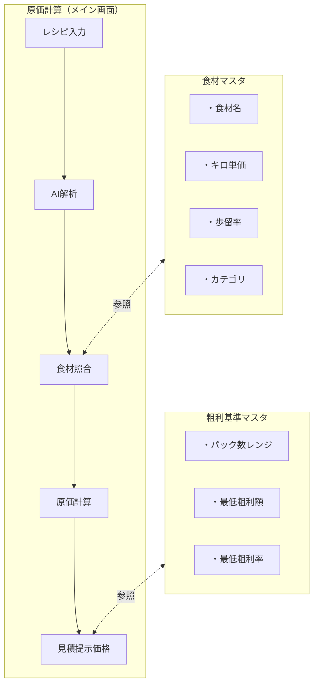
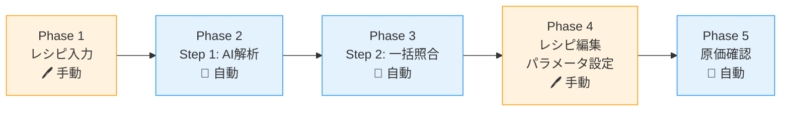
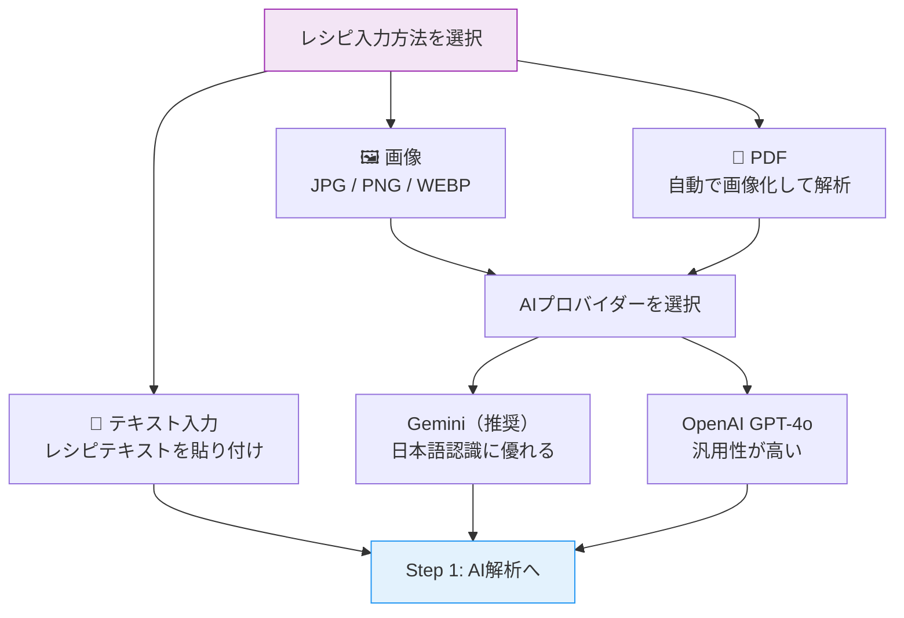
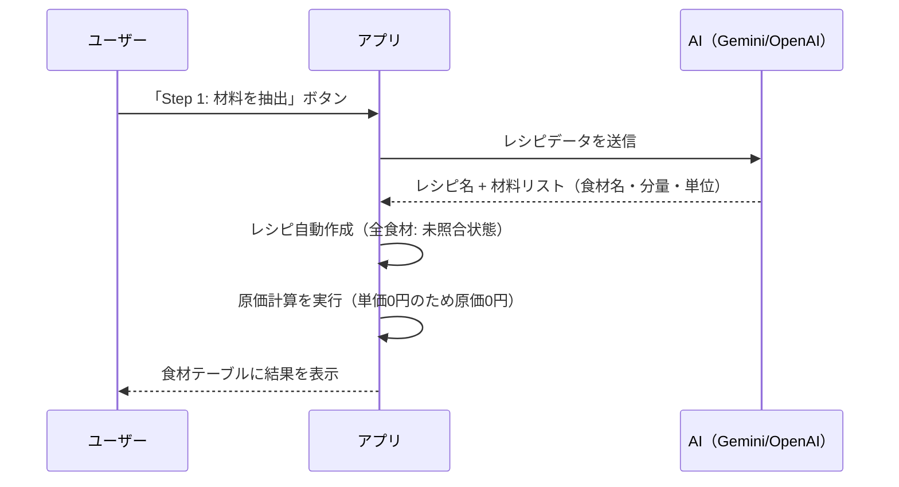
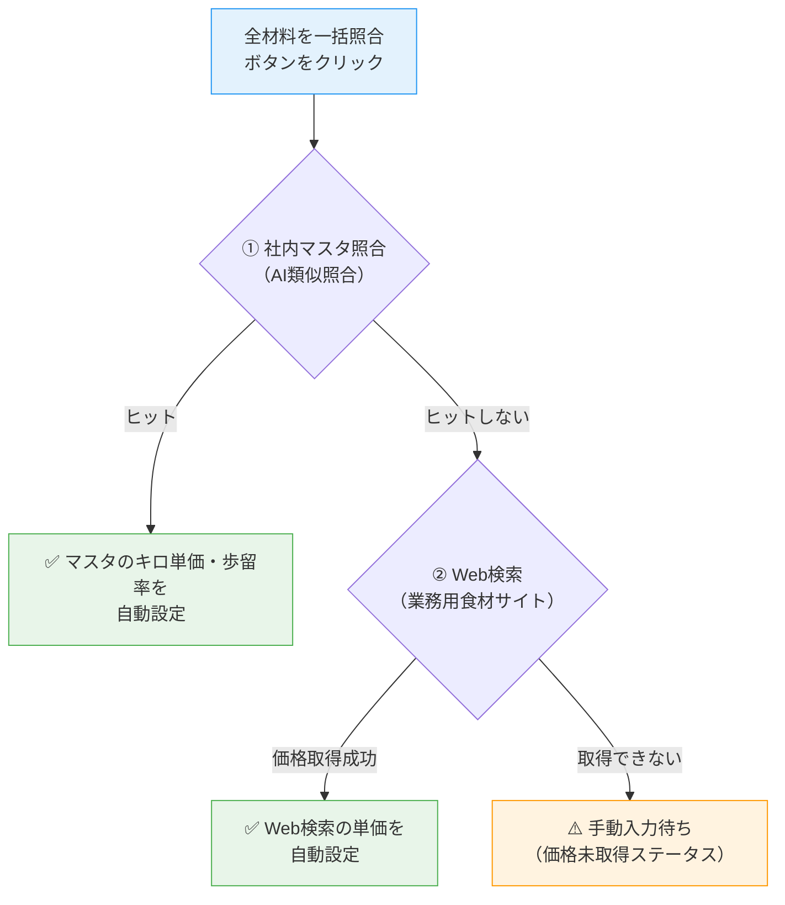
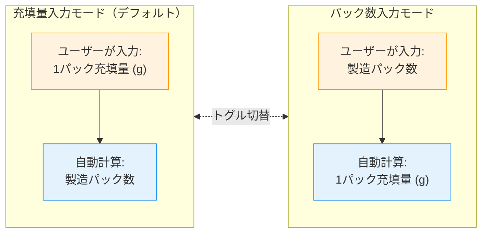
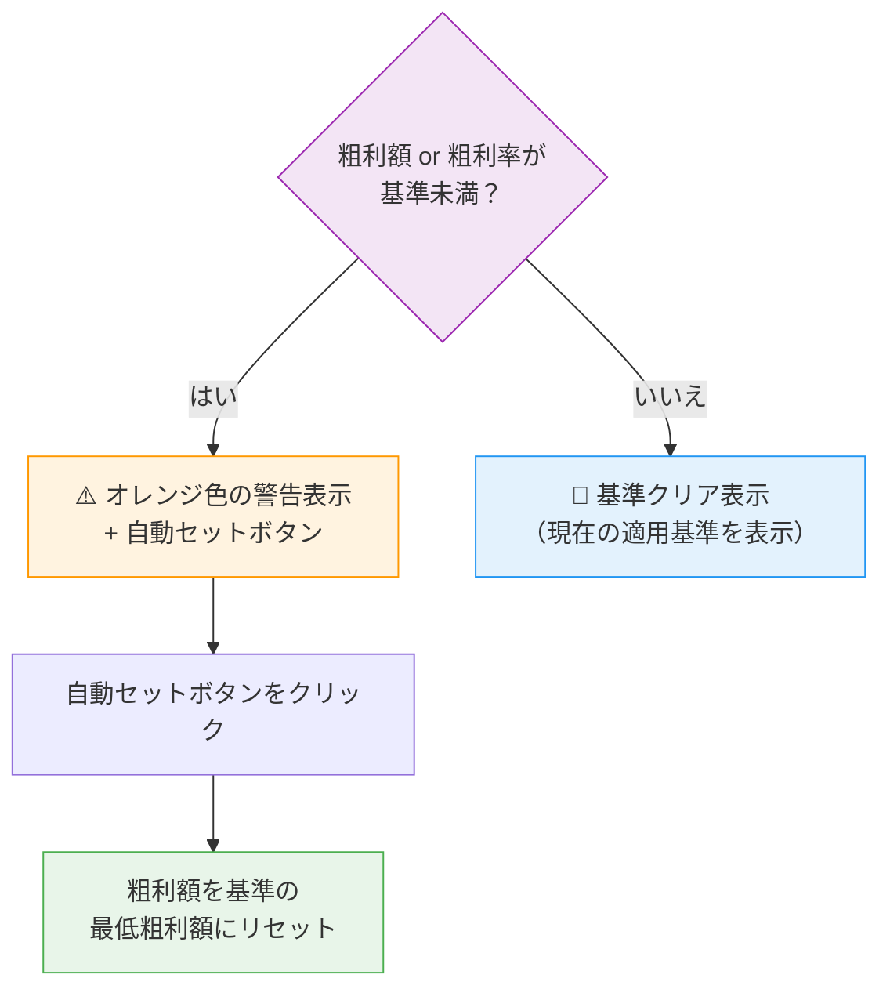
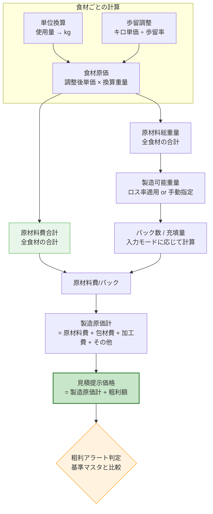
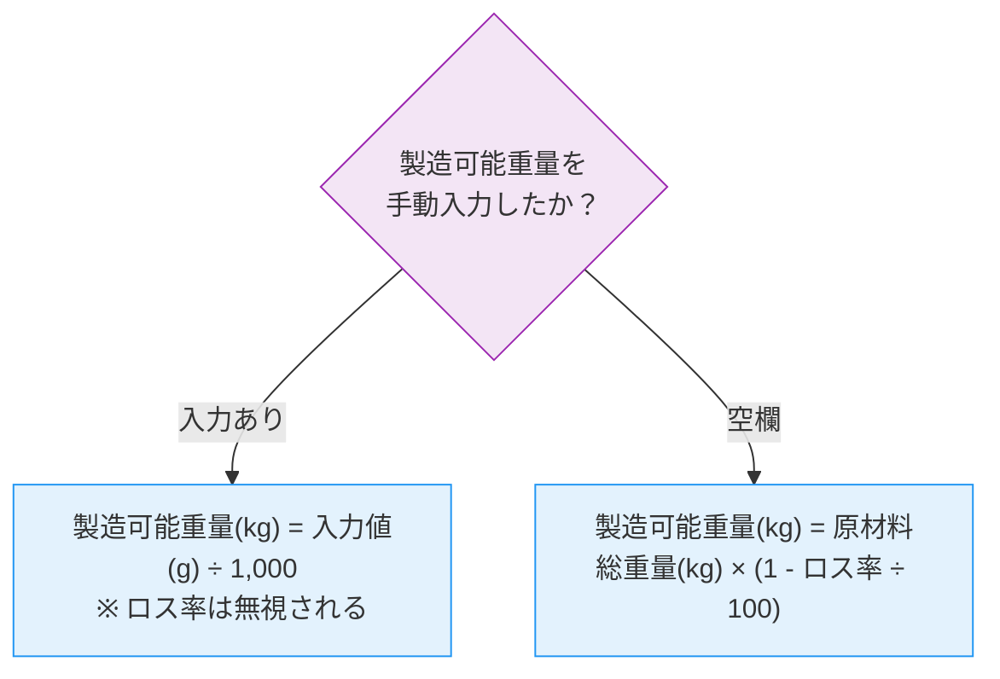
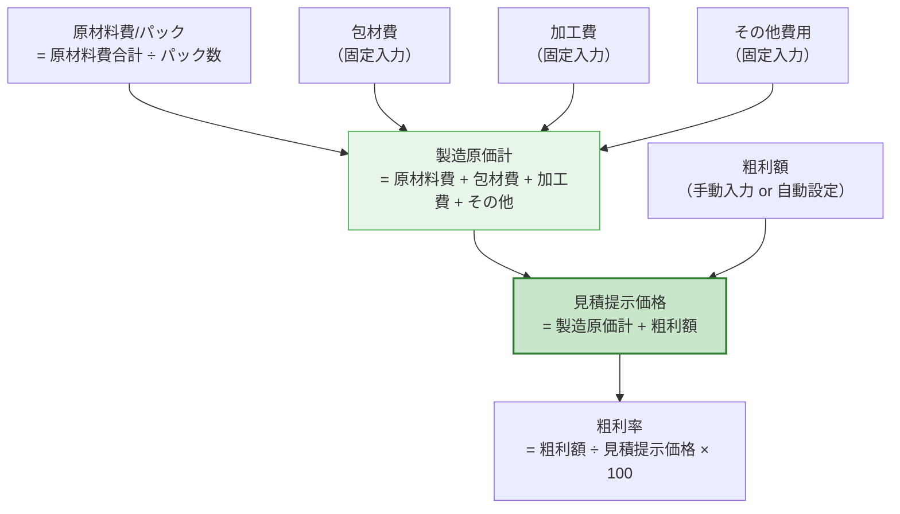

# AI原価計算アプリ 設計書（ユーザーマニュアル）

---

## 第1章: システム概要

### 1.1 目的

本アプリは、食品OEM製造における原価計算を自動化するシステムです。

レシピ（テキスト・画像・PDF）をAIが解析し、食材の抽出から単価照合、原価計算までを一貫して行います。従来の手作業による原価計算を大幅に効率化し、見積提示価格の算出までをサポートします。

### 1.2 3ページの構成と関係

本アプリは以下の3つのページで構成されています。



| ページ             | 役割                                                                        |
| ------------------ | --------------------------------------------------------------------------- |
| **原価計算**       | レシピを入力し、AI解析→食材照合→原価計算→見積提示価格の算出を行うメイン画面 |
| **食材マスタ**     | 自社で使用する食材の名称・キロ単価・歩留率を管理するマスタデータ            |
| **粗利基準マスタ** | パック数レンジごとの最低粗利額・最低粗利率を管理する基準テーブル            |

**データの流れ:**

- 原価計算時、まず**食材マスタ**からAI類似照合で単価を取得（社内マスタ優先）
- マスタにヒットしない食材は**Web検索**で外部価格を自動取得
- 計算結果の粗利は**粗利基準マスタ**と照合し、基準を下回る場合にアラートを表示

---

## 第2章: 初回セットアップ（運用開始まで）

アプリを使い始めるには、2つのマスタデータを登録します。


### Step 1: 食材マスタの登録

食材マスタには、自社で使用する食材のキロ単価と歩留率を登録します。

#### 方法A: 初期データ投入（推奨）

「食材マスタ」ページの**初期データ投入**ボタンを押すと、一般的な食材52品目がまとめて登録されます。

初期データに含まれるカテゴリ:

| カテゴリ   | 品目数 | 代表的な食材                              |
| ---------- | ------ | ----------------------------------------- |
| 野菜       | 15品目 | にんじん、たまねぎ、キャベツ、トマト 等   |
| 肉類       | 9品目  | 鶏もも肉、鶏むね肉、豚バラ肉、牛ひき肉 等 |
| 魚介類     | 5品目  | さけ（切身）、えび、いか 等               |
| 大豆製品   | 4品目  | 木綿豆腐、油揚げ 等                       |
| 卵・乳製品 | 4品目  | 鶏卵、牛乳、バター 等                     |
| 調味料     | 10品目 | 食塩、濃口しょうゆ、味噌 等               |
| 穀物       | 5品目  | 白米、パスタ（乾燥）、小麦粉 等           |

> **注意**: 初期データ投入は既存の食材マスタを**全て削除**してから登録します。既にカスタムデータがある場合はご注意ください。

#### 方法B: 手動登録

「食材マスタ」ページで1件ずつ食材を登録します。詳細は第6章を参照してください。

### Step 2: 粗利基準マスタの設定

粗利基準マスタには、パック数レンジごとの最低粗利額と最低粗利率を設定します。

#### 方法A: 初期データ投入（推奨）

「粗利基準マスタ」ページの**初期データ投入**ボタンを押すと、デフォルトの8段階基準が登録されます。

| パック数レンジ     | 最低粗利額 | 最低粗利率 |
| ------------------ | ---------- | ---------- |
| 100 〜 299         | 300円      | 50%        |
| 300 〜 499         | 250円      | 45%        |
| 500 〜 999         | 150円      | 40%        |
| 1,000 〜 1,999     | 100円      | 35%        |
| 2,000 〜 2,999     | 80円       | 32%        |
| 3,000 〜 6,999     | 80円       | 30%        |
| 7,000 〜 9,999     | 60円       | 30%        |
| 10,000 〜 上限なし | 50円       | 30%        |

#### 方法B: カスタム設定

自社の粗利ポリシーに合わせて、独自の基準を追加・編集できます。詳細は第7章を参照してください。

### セットアップ完了

両方のマスタを登録すれば、原価計算を開始できます。

---

## 第3章: 原価計算の操作手順（メイン機能）

### 3.1 全体フロー

原価計算は以下の5つのフェーズで進行します。



| フェーズ                 | 操作内容                                              | 自動/手動 |
| ------------------------ | ----------------------------------------------------- | --------- |
| Phase 1: レシピ入力      | テキスト貼り付け / 画像アップロード / PDFアップロード | 手動      |
| Phase 2: Step 1 AI解析   | AIがレシピから食材名・分量・単位を自動抽出            | 自動      |
| Phase 3: Step 2 一括照合 | 食材マスタ→Web検索の順で単価を自動取得                | 自動      |
| Phase 4: レシピ編集      | 食材の修正・追加・削除、製造パラメータ設定            | 手動      |
| Phase 5: 原価確認        | 原価計算結果・見積提示価格・粗利アラートを確認        | 自動      |

### 3.2 レシピ入力（Phase 1）

原価計算画面の「新規レシピ作成」ボタンを押すと、レシピ入力エリアが表示されます。

#### 入力方法の選択

3種類の入力方法から選択できます。



| 入力方法         | 対応形式       | 説明                                              |
| ---------------- | -------------- | ------------------------------------------------- |
| **テキスト入力** | テキスト       | レシピテキストをテキストエリアに貼り付け          |
| **画像**         | JPG, PNG, WEBP | レシピ画像をアップロード                          |
| **PDF**          | PDF            | PDFファイルをアップロード（自動で画像化して解析） |

| プロバイダー       | 特徴                                                   |
| ------------------ | ------------------------------------------------------ |
| **Gemini（推奨）** | 日本語テキスト認識に優れ、表形式データの抽出精度が高い |
| **OpenAI GPT-4o**  | 汎用性が高く安定した結果を返す                         |

### 3.3 Step 1: AI解析（Phase 2）

**「Step 1: 材料を抽出」** ボタンを押すと、AIが自動でレシピを解析します。



**Step 1 完了後の状態:**

- 食材テーブルに抽出された材料が一覧表示される
- 各食材の「取得元」は「未照合」
- キロ単価は全て 0円

### 3.4 Step 2: 一括照合（Phase 3）

**「全材料を一括照合」** ボタンを押すと、全食材の単価を自動取得します。



#### ① 社内マスタ照合

- 食材マスタに登録された食材とAI類似照合を行う
- 「北海道産玉ねぎ」→「たまねぎ」のように、表記揺れがあってもAIが同一食材と判定すればヒット
- ヒットした場合、マスタのキロ単価・歩留率が自動設定される

#### ② Web検索

- マスタにヒットしなかった食材はWeb検索で業務用価格を自動取得
- AIが食材名を一般化（「国産有機玉ねぎ」→「玉ねぎ」）してから検索
- 取得元（A-Price、楽天市場、Web検索）と商品名・価格が記録される

#### ③ 手動入力

- Web検索でも価格を取得できなかった食材は「価格未取得」ステータスになる
- 食材テーブルで手動でキロ単価を入力するか、個別の「AI照合」ボタンで再検索が可能

**一括照合はやり直し可能です。** ボタンを何度でも押して全食材を再照合できます。

### 3.5 レシピ編集（Phase 4）

Step 2 完了後（または途中でも）、食材テーブルで各食材の情報を編集できます。

#### 食材テーブルの列構成

| 列名           | 説明                                           | 編集可否 |
| -------------- | ---------------------------------------------- | -------- |
| 解析された名前 | AIが抽出した元の食材名                         | 表示のみ |
| マスタ割当     | 食材マスタからの割り当て（ドロップダウン選択） | 編集可   |
| 取得元詳細     | 社内マスタ / 外部サイト名 / 手動入力           | 表示のみ |
| 分量 / 単位    | 使用量と単位（g, kg, mL, L, cc）               | 編集可   |
| 換算重量       | kgに自動換算された重量（自動計算）             | 表示のみ |
| キロ単価       | 1kgあたりの単価（円/kg）                       | 編集可   |
| AI照合         | 個別食材のAI照合ボタン                         | ボタン   |
| 歩留(%)        | 歩留率（可食部の割合）                         | 編集可   |
| 調整後単価     | 歩留調整後のキロ単価（自動計算）               | 表示のみ |
| 原価小計       | 調整後単価 × 換算重量（自動計算）              | 表示のみ |
| 削除           | 食材を削除するボタン                           | ボタン   |

#### 操作ポイント

- **マスタ割当を変更**: ドロップダウンから別のマスタ食材を選択すると、キロ単価と歩留率がマスタの値に即座に更新される
- **AI照合ボタン**: 個別の食材に対してAI照合（マスタ照合→Web検索）を実行。一括照合後に特定の食材だけ再検索したい場合に便利
- **手動でキロ単価を変更**: 外部取得された単価が実勢と異なる場合、直接数値を入力して上書き可能
- **原材料を手動追加**: テーブル上部の「原材料を手動追加」ボタンで新規行を追加可能

### 3.6 製造パラメータ設定

「製造パラメータ」パネルで、製造条件を設定します。

#### パラメータ一覧

| パラメータ           | デフォルト値   | 説明                                                                     |
| -------------------- | -------------- | ------------------------------------------------------------------------ |
| レシピ合計量（参考） | 自動計算       | 全食材の換算重量合計（g表示）                                            |
| 製造可能重量 (g)     | 空（自動計算） | 実際の製造可能重量を手動指定する場合に入力。空の場合はロス率から自動計算 |
| 製造ロス率 (%)       | 5%             | 製造工程でのロス率。製造可能重量を手動指定した場合は無効                 |
| ロス適用後重量       | 自動計算       | ロス率適用後（または手動指定）の製造可能重量                             |

#### 入力モード切替

2つの入力モードをトグルで切り替えられます。



#### 再計算ボタン

パラメータを変更したら「再計算」ボタンを押してください。値が変更されていない場合、再計算ボタンは無効化（グレーアウト）されます。

### 3.7 原価計算結果の確認（Phase 5）

「原価見積」パネルに計算結果が表示されます。

#### パネル構成

| 項目              | 説明                          | 編集可否                    |
| ----------------- | ----------------------------- | --------------------------- |
| 原材料費 / パック | 原材料費合計 ÷ パック数       | 表示のみ                    |
| 包材費            | パッケージの費用（円/パック） | 編集可（デフォルト: 30円）  |
| 加工費            | 加工の費用（円/パック）       | 編集可（デフォルト: 50円）  |
| その他費用        | その他の費用（円/パック）     | 編集可（デフォルト: 0円）   |
| **製造原価計**    | 上記4項目の合計               | 表示のみ                    |
| 粗利（額）        | 1パックあたりの粗利額         | 編集可（デフォルト: 200円） |
| 粗利率            | 粗利額 ÷ 見積提示価格 × 100   | 表示のみ                    |
| **見積提示価格**  | 製造原価計 + 粗利額           | 表示のみ                    |

#### 粗利アラート



#### 再計算ボタン

包材費・加工費・その他費用・粗利額を変更したら「再計算」ボタンを押してください。

---

## 第4章: 計算ロジック詳細

### 4.0 計算の全体像



### 4.1 単位換算

レシピに記載された単位をkg（キログラム）に統一換算します。

| 単位   | 変換式                  |
| ------ | ----------------------- |
| kg     | そのまま                |
| g      | ÷ 1,000                 |
| L      | そのまま（比重1.0想定） |
| mL, cc | ÷ 1,000（比重1.0想定）  |
| 不明   | g扱い（÷ 1,000）        |

```
換算重量(kg) = 単位変換(使用量, 単位)
```

### 4.2 歩留調整単価

歩留まり（可食部の割合）を考慮した実効単価を算出します。

```
調整後単価 = キロ単価 ÷ (歩留率 ÷ 100)
```

| 歩留率 | 意味                 | 単価への影響        |
| ------ | -------------------- | ------------------- |
| 100%   | ロスなし（調味料等） | 単価変更なし        |
| 90%    | 1割が廃棄部分        | 単価 ×1.11          |
| 85%    | 1.5割が廃棄部分      | 単価 ×1.18          |
| 80%    | 2割が廃棄部分        | 単価 ×1.25          |
| 70%    | 3割が廃棄部分        | 単価 ×1.43          |
| 0%     | —                    | 0円（ゼロ除算回避） |

### 4.3 食材原価

```
食材原価 = 調整後単価 × 換算重量(kg)
```

### 4.4 合計値

```
原材料費合計 = 全食材の食材原価の合計
原材料総重量 = 全食材の換算重量の合計
```

### 4.5 製造可能重量の決定



### 4.6 パック数・充填量の計算

入力モードに応じて計算方向が異なります。

#### 充填量入力モード

ユーザーが1パック充填量を入力 → パック数を自動算出

```
パック数 = 切り捨て(製造可能重量(kg) ÷ (充填量(g) ÷ 1,000))
```

#### パック数入力モード

ユーザーがパック数を入力 → 充填量を自動算出

```
充填量(g) = (製造可能重量(kg) × 1,000) ÷ パック数
```

> パック数が0の場合、充填量は計算されません（無限大防止）。

### 4.7 原価計算



| 項目             | 算出方法                                       |
| ---------------- | ---------------------------------------------- |
| 原材料費/パック  | 原材料費合計 ÷ パック数                        |
| 包材費           | 固定入力（円/パック）                          |
| 加工費           | 固定入力（円/パック）                          |
| その他費用       | 固定入力（円/パック）                          |
| **製造原価計**   | 原材料費/パック + 包材費 + 加工費 + その他費用 |
| 粗利額           | 手動入力 or 自動設定（円/パック）              |
| **見積提示価格** | 製造原価計 + 粗利額                            |
| 粗利率           | 粗利額 ÷ 見積提示価格 × 100                    |

### 4.8 粗利の自動提案

再計算実行時、パック数に応じた粗利基準マスタを参照し、条件を満たす場合に粗利額を自動設定します。

#### 自動設定の条件

以下の**いずれか**を満たす場合のみ自動設定されます:

1. **初回デフォルト値** — 粗利額がデフォルトの200円のまま
2. **前回の基準値** — 粗利額が前回パック数に対応する基準の最低粗利額と一致

> ユーザーが手動で粗利額を変更した場合は、自動設定されません。

### 4.9 粗利アラート判定

パック数に該当する粗利基準と現在の粗利を比較し、以下の場合に警告を表示します。

```
粗利額が基準未満 = 粗利額 < 最低粗利額
粗利率が基準未満 = 粗利率 < 最低粗利率
警告あり         = 粗利額が基準未満 または 粗利率が基準未満
```

**自動セットボタン**: 警告時に粗利入力欄の横に表示されます。クリックすると基準の最低粗利額にリセットされます。

---

## 第5章: 計算例（実践チュートリアル）

### 入力条件

以下のレシピで計算の流れを確認します。

**レシピ: 鶏肉とキャベツの炒め物**

| 食材     | 使用量 | 単位 | キロ単価(円/kg) | 歩留率(%) |
| -------- | ------ | ---- | --------------- | --------- |
| 鶏むね肉 | 3,000  | g    | 1,200           | 85        |
| キャベツ | 2,000  | g    | 300             | 90        |
| 調味料A  | 500    | g    | 2,000           | 100       |

**製造パラメータ:**

- 製造ロス率: 5%
- 入力モード: 充填量入力
- 1パック充填量: 200g

**コスト設定:**

- 包材費: 30円
- 加工費: 50円
- その他費用: 0円
- 粗利額: 200円（デフォルト）

### ステップ1: 単位換算と食材原価

| 食材     | 使用量 | 換算重量(kg) | 調整後単価(円/kg)    | 食材原価(円)            |
| -------- | ------ | ------------ | -------------------- | ----------------------- |
| 鶏むね肉 | 3,000g | 3.0          | 1,200 ÷ 0.85 = 1,412 | 1,412 × 3.0 = **4,235** |
| キャベツ | 2,000g | 2.0          | 300 ÷ 0.90 = 333     | 333 × 2.0 = **667**     |
| 調味料A  | 500g   | 0.5          | 2,000 ÷ 1.00 = 2,000 | 2,000 × 0.5 = **1,000** |

- **原材料費合計** = 4,235 + 667 + 1,000 = **5,902円**
- **原材料総重量** = 3.0 + 2.0 + 0.5 = **5.5kg**

### ステップ2: 製造可能重量

製造可能重量が手動指定されていないので、ロス率から自動計算:

```
製造可能重量 = 5.5kg × (1 - 5 ÷ 100) = 5.5 × 0.95 = 5.225kg
```

### ステップ3: パック数

充填量入力モード（200g/パック）:

```
パック数 = 切り捨て(5.225 ÷ 0.2) = 切り捨て(26.125) = 26パック
```

### ステップ4: 原価計算

```
原材料費/パック = 5,902 ÷ 26 = 227円
製造原価計     = 227 + 30 + 50 + 0 = 307円
見積提示価格   = 307 + 200 = 507円
粗利率         = 200 ÷ 507 × 100 = 39.4%
```

### ステップ5: 粗利アラートの確認

パック数 = 26 は、粗利基準マスタの最小レンジ（100〜299）未満のため、該当する基準がありません。アラートは表示されません。

#### もしパック数が500の場合

仮に充填量を小さく設定してパック数が500になった場合:

- 該当基準: 500〜999食 → 最低粗利額 150円 / 最低粗利率 40%
- 粗利額 200円 > 150円 → 額は基準クリア
- 粗利率 39.4% < 40% → **率が基準未満で警告表示**

この場合、「粗利率が基準を下回っています（基準: 40%以上）」と警告が表示され、「自動セット」ボタンで粗利額を150円にリセットできます。

---

## 第6章: 食材マスタ管理（ページ詳細）

### 6.1 一覧画面

食材マスタページを開くと、登録済みの食材がカテゴリ順・名前順で一覧表示されます。

### 6.2 検索

検索バーに文字を入力すると、以下のフィールドで部分一致検索されます:

- 食材名
- カテゴリ
- 仕入先

### 6.3 新規登録

「新規登録」ボタンを押し、以下の項目を入力します。

| 項目              | 必須 | 説明                | 入力例   |
| ----------------- | ---- | ------------------- | -------- |
| 食材名            | ○    | 正式な食材名称      | 鶏もも肉 |
| キロ単価（円/kg） | ○    | 1kgあたりの仕入単価 | 900      |
| 歩留率（%）       | ○    | 可食部の割合        | 90       |
| カテゴリ          | ○    | 分類                | 肉類     |
| 仕入先            | ○    | 仕入先名称          | 一般仕入 |

#### 歩留率の目安

| 食材タイプ                       | 歩留率の目安 | 理由                       |
| -------------------------------- | ------------ | -------------------------- |
| 調味料・液体・缶詰               | 100%         | 廃棄部分なし               |
| 葉物野菜（もやし、トマト等）     | 90〜95%      | 少量の廃棄                 |
| 根菜類（にんじん、じゃがいも等） | 80〜85%      | 皮むきロス                 |
| 肉類                             | 85〜100%     | 部位による（ひき肉は100%） |
| 魚介類                           | 70〜85%      | 殻・骨のロス               |
| ブロッコリー等                   | 70%          | 茎のロスが大きい           |

### 6.4 編集

一覧から食材をクリックすると、編集画面が開きます。キロ単価や歩留率を変更できます。

> **注意**: マスタの単価を変更しても、過去に作成済みのレシピの食材原価は自動更新されません。過去レシピを再計算するには、該当レシピの「再計算」ボタンを押してください。

### 6.5 削除

食材を削除するには、一覧から食材を選択して「削除」ボタンを押します。

> **注意**: 削除した食材がレシピで使用されていても、レシピ側のデータは保持されます（マスタとの紐付けが切れるだけです）。

---

## 第7章: 粗利基準マスタ管理（ページ詳細）

### 7.1 デフォルト8段階の基準テーブル

初期データ投入で登録される基準は以下の通りです。

| #   | パック数下限 | パック数上限 | 最低粗利額（円） | 最低粗利率（%） |
| --- | ------------ | ------------ | ---------------- | --------------- |
| 1   | 100          | 299          | 300              | 50              |
| 2   | 300          | 499          | 250              | 45              |
| 3   | 500          | 999          | 150              | 40              |
| 4   | 1,000        | 1,999        | 100              | 35              |
| 5   | 2,000        | 2,999        | 80               | 32              |
| 6   | 3,000        | 6,999        | 80               | 30              |
| 7   | 7,000        | 9,999        | 60               | 30              |
| 8   | 10,000       | 上限なし     | 50               | 30              |

**考え方**: パック数が多い（大量生産）ほど、1パックあたりの利益を抑えてもトータルで十分な利益が確保できるため、最低粗利額・率は低く設定されています。

### 7.2 各項目の説明

| 項目         | 説明                                                   |
| ------------ | ------------------------------------------------------ |
| パック数下限 | この基準が適用されるパック数の下限                     |
| パック数上限 | この基準が適用されるパック数の上限。空の場合は上限なし |
| 最低粗利額   | パック数レンジに対する最低粗利額（円/パック）          |
| 最低粗利率   | パック数レンジに対する最低粗利率（%）                  |

### 7.3 カスタム基準の追加・編集・削除

- **追加**: 「新規追加」ボタンで新しいパック数レンジの基準を追加
- **編集**: 一覧から基準を選択して値を編集
- **削除**: 不要な基準を削除

> **注意**: パック数レンジが重複しないよう設定してください。重複した場合、最初にヒットした基準が適用されます。

---

## 第8章: 用語集

| 用語                   | 説明                                                                                  |
| ---------------------- | ------------------------------------------------------------------------------------- |
| **キロ単価**           | 1kgあたりの仕入単価（円/kg）                                                          |
| **歩留率（歩留まり）** | 食材全体のうち、実際に使用できる可食部分の割合（%）。皮や骨などの廃棄部分を考慮した値 |
| **調整後単価**         | 歩留率を考慮した実効的なキロ単価。キロ単価 ÷ (歩留率/100) で算出                      |
| **換算重量**           | レシピ記載の使用量をkgに統一換算した重量                                              |
| **製造ロス率**         | 製造工程で発生するロスの割合（%）。煮詰まり、付着、こぼし等を想定                     |
| **製造可能重量**       | ロス適用後（または手動指定）の実際に製品化できる重量                                  |
| **充填量**             | 1パック（1食分）に充填する重量（g）                                                   |
| **パック数**           | 1バッチの製造で作れるパック（食）数                                                   |
| **原材料費/パック**    | 全食材の原価合計をパック数で割った、1パックあたりの原材料費                           |
| **包材費**             | パッケージ（容器、ラベル等）の1パックあたりの費用                                     |
| **加工費**             | 製造加工の1パックあたりの費用（人件費、光熱費等を含む）                               |
| **製造原価計**         | 原材料費/パック + 包材費 + 加工費 + その他費用                                        |
| **粗利額**             | 1パックあたりの利益額                                                                 |
| **粗利率**             | 見積提示価格に占める粗利の割合（%）                                                   |
| **見積提示価格**       | 製造原価計 + 粗利額。クライアントに提示する1パックあたりの価格                        |
| **粗利基準マスタ**     | パック数レンジごとに設定された最低粗利額・最低粗利率のテーブル                        |
| **粗利アラート**       | 現在の粗利が基準を下回った場合に表示される警告                                        |
| **AI類似照合**         | AIを使って、レシピの食材名と食材マスタを類似度で照合する機能                          |
| **OEM**                | Original Equipment Manufacturer。他社ブランド向けの受託製造                           |
| **OCR**                | Optical Character Recognition。画像からテキストを読み取る技術                         |
