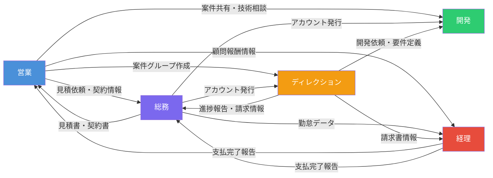

# frankart社 業務内容一覧

## 全体概要

frankart社の業務を5部門（営業・総務・開発・ディレクション・経理）に分類し、各部門の業務フロー・使用ツール・部門間連携を整理したドキュメントです。

### 部門間連携の全体像



### 使用ツール一覧

| ツール | 用途 | 使用部門 |
|--------|------|----------|
| Chatwork | 社内外チャット・案件グループ管理 | 全部門 |
| Slack | クライアントとのやりとり（先方指定時） | ディレクション・総務 |
| rakumo | スケジュール管理（Googleカレンダー連携） | 全部門 |
| Google Meet | オンライン会議 | 全部門 |
| メール | 外部とのフォーマル連絡 | 営業・総務 |
| Google Drive | ファイル格納・共有 | 全部門 |
| クラウドサイン | 電子契約締結 | 総務 |
| エンジニアダッシュ | SES要員マッチング | 総務 |
| スプレッドシート | 各種管理シート（営業・名刺・顧問・アカウント等） | 営業・総務・経理 |
| エクセル | 経理報告・データ加工 | 経理 |
| 弥生会計 | 会計ソフト（仕訳・証憑管理） | 経理 |
| Backlog / Jira | チケット管理 | ディレクション |
| Lark | クライアント指定時のコミュニケーション | ディレクション |
| Figma / XD / Photoshop / Illustrator | デザイン作成 | ディレクション |
| HiProBiz / ビザスク / LinkedIn | 営業顧問開拓 | 営業 |

---

## 1. 営業部門（茂木・佐藤）

### 業務フロー

```mermaid
graph TD
    subgraph リード獲得
        A1[マッチングサービスから案件メール受信] -->|受動| A2[案件内容確認]
        A2 --> A3[エントリー実施]
        A3 --> A4[フォロー連絡<br/>3営業日後]
        A4 --> A5[結果を営業管理シートへ記録]

        B1[営業顧問から案件紹介] -->|受動| B2[案件概要確認・社内共有]
        B2 --> B3[顧問と連携しアプローチ調整]
    end

    subgraph 商談プロセス
        A5 --> C1[商談前準備<br/>rakumo登録・企業リサーチ]
        B3 --> C1
        C1 --> C2[初回商談・ヒアリング]
        C2 --> C3[議事録作成・Chatwork共有]
        C3 --> C4[お礼メール送付<br/>翌営業日]
        C4 --> C5[営業管理シート更新]
    end

    subgraph 提案〜契約
        C5 --> D1[提案・見積対応]
        D1 -->|見積作成| D2[総務へ見積作成依頼]
        D2 --> D3[見積書確認・提出]
        D3 --> D4{受注判定}
        D4 -->|受注| E1[契約情報を総務へ連携]
        D4 -->|失注/保留| F1[フォローアップ<br/>2週間〜1ヶ月]
        F1 --> F2[数ヶ月後に状況確認]
    end

    subgraph プロジェクト管理
        E1 --> G1[Chatwork案件グループ作成]
        G1 --> G2[定期進捗確認]
        G2 --> G3[営業管理シート随時更新]
    end

    style A1 fill:#E8F4FD
    style B1 fill:#E8F4FD
```

### 業務詳細

#### 1-1. リード・エントリー対応（マッチングサービス経由）

| 区分 | 業務内容 | ツール |
|------|----------|--------|
| 受動 | マッチングサービスから案件メール受信 → 内容（業種・規模・予算・要件等）を確認 | Chatwork |
| 能動 | 井上さんの依頼に基づき、必要情報（会社概要・実績・希望日程等）を添えてエントリー | メール |
| 能動 | エントリー後、進捗がない場合は**3営業日**を目処にフォロー連絡 | メール |
| 能動 | エントリー結果（通過・非通過）を営業管理シートへ記録・更新 | 営業管理シート |
| 能動 | 報告書メールより先方担当者のメールアドレスを確認 | メール |

#### 1-2. リード・エントリー対応（顧問経由）

| 区分 | 業務内容 | ツール |
|------|----------|--------|
| 受動 | 営業顧問からの案件紹介連絡を受け、案件概要を確認・社内共有 | 営業管理シート |
| 能動 | 対応可能な場合、顧問へ連絡しアプローチ方法を調整 | メール・Chatwork |
| 能動 | 商談終了後、顧問へ先方担当者のメール共有を依頼 | メール・Chatwork |
| 能動 | 受注時：顧問報酬の発生有無・金額を確認し**経理へ支払い手続きを依頼** | 顧問契約書 |
| 能動 | 失注時：結果を顧問へ報告し次回案件につながる情報共有 | メール・Chatwork |

> **部門間連携**: 受注時に経理部門へ顧問報酬の支払い依頼が発生

#### 1-3. 商談前準備

| 区分 | 業務内容 | ツール |
|------|----------|--------|
| 能動 | 商談日程確定 → rakumoカレンダーへ予定登録 | rakumo |
| 能動 | 先方企業リサーチ → 提案内容整理 → rakumo備考へ追記 | rakumo |
| 能動 | 必要に応じて技術担当者（山口さん）へ同席依頼 | - |
| 能動 | 対面商談の場合、会社案内・実績資料・サービス資料等を準備 | 営業資料 |

> **部門間連携**: 技術的な商談では開発部門（山口さん）に同席を依頼

#### 1-4. 商談・初回ヒアリング

| 区分 | 業務内容 | ツール |
|------|----------|--------|
| 能動 | 初回商談実施 → 先方の課題・要件・予算・スケジュール等をヒアリング | 議事録 |
| 能動 | 商談終了後、**当日中**に議事録作成 → Chatwork「営業案件進捗」グループへ共有 | 議事録・Chatwork |
| 能動 | 商談**翌営業日**までにお礼メール送付 | メール |
| 能動 | 商談内容を営業管理シートへ記録・更新 | 営業管理シート |
| 能動 | 井上さんと提案内容をまとめ、先方へ提出 | メール |

#### 1-5. フォローアップ・追客

| 区分 | 業務内容 | ツール |
|------|----------|--------|
| 能動 | 初回商談後、回答がない場合は**2週間〜1ヶ月**を目処にリマインドメール送付 | メール |
| 能動 | リマインド後も反応がない場合、電話やChatwork等の別手段でコンタクト | メール・Chatwork |
| 能動 | 案件進捗をフェーズ（検討中・提案中・失注・保留等）に分類し営業管理シート更新 | 営業管理シート |
| 能動 | 失注・保留案件も**数ヶ月後**を目処に状況確認フォロー | メール |

#### 1-6. 提案・見積対応

| 区分 | 業務内容 | ツール |
|------|----------|--------|
| 受動 | 先方からRFP・要件定義資料を受領 → 社内（PM・技術担当）へ共有し対応可否協議 | RFP |
| 能動 | 見積作成が必要な場合、**総務へ見積作成を依頼** | 見積書 |
| 能動 | 見積書確認後、先方へ提出 | 見積書 |
| 能動 | 見積提出後、反応がない場合は**1週間**を目処にフォロー連絡 | メール |
| 受動 | 見積に関する質問・修正依頼を受け、社内確認し回答または追加商談設定 | 見積書 |

> **部門間連携**: 見積作成は総務部門に依頼、技術的な判断は開発部門と協議

#### 1-7. 契約対応

| 区分 | 業務内容 | ツール |
|------|----------|--------|
| 能動 | 受注確定 → 契約情報（会社名・住所・担当者・契約内容等）を**総務へ連携** | 業務委託契約書 |
| 能動 | NDA必要時、先方の必要情報を**総務へ連携**し締結手続き依頼 | 秘密保持契約書 |
| 能動 | 締結済み契約書をドライブの所定フォルダへ格納 | 契約書・Drive |
| 能動 | 契約更新時期を管理表で管理 → 期限が近づいたら更新手続き | 契約管理表 |

> **部門間連携**: 契約書作成・締結フローは総務部門が担当

#### 1-8. 案件・プロジェクト管理

| 区分 | 業務内容 | ツール |
|------|----------|--------|
| 能動 | 案件具体化 → Chatworkに【案件】会社名グループ作成 → 関係者招待 | Chatwork |
| 能動 | プロジェクト開始後、定期的に進捗確認 → 課題・リスクを社内共有 | 議事録 |
| 能動 | ステータス（提案中・受注・進行中・完了・失注）を営業管理シート更新 | 営業管理シート |

#### 1-9. 営業顧問・外部パートナー管理

| 区分 | 業務内容 | ツール |
|------|----------|--------|
| 能動 | 営業顧問との定例MTG（毎月）→ 案件状況・新規開拓方針の情報共有 | 議事録 |
| 能動 | マッチングサービス担当者との定例MTG（毎月）→ 新規案件・進捗確認 | 議事録 |
| 能動 | 定例MTG後、議事録作成 → Chatwork共有 | 議事録・Chatwork |
| 能動 | 顧問報酬発生時、**経理へ必要情報**（振込先・金額・支払時期）を連携 | 顧問契約書 |

#### 1-10. 新規営業顧問の開拓

| 区分 | 業務内容 | ツール |
|------|----------|--------|
| 能動 | マッチングサービスへ顧問要件を伝え候補者提案を依頼 | HiProBiz等 |
| 能動 | ビザスクで営業顧問を検索 → プロフィール確認後コンタクト | ビザスク |
| 能動 | LinkedInで営業顧問を検索 → メッセージでアプローチ | LinkedIn |
| 能動 | 候補者との初回面談 → 自社サービス・案件内容・報酬条件等を説明 | 議事録 |
| 能動 | 契約条件合意 → **総務へ顧問契約締結手続き依頼** | 顧問契約書 |
| 能動 | 新規顧問情報を顧問管理スプレッドシートへ記録 | 顧問管理シート |

#### 1-11. 情報・データ管理

| 区分 | 業務内容 | ツール |
|------|----------|--------|
| 能動 | 営業アクション実施後、営業管理シートへ記録・更新 | 営業管理シート |
| 能動 | 名刺受領 → **翌営業日以内**にスプレッドシートへ記録 | 名刺管理シート |
| 能動 | 新規アカウント作成時、アカウント情報をスプレッドシートへ記録 | アカウント管理シート |
| 能動 | 各種サービスの契約更新時期を定期確認 → 更新・解約判断 | 契約管理表 |
| 能動 | 社内ドライブのフォルダ構成を整理・格納 | Drive |

#### 1-12. 社内連携・報告

| 区分 | 業務内容 | ツール |
|------|----------|--------|
| 能動 | 営業進捗（案件数・商談数・受注状況・課題等）を**週次**で社長へ報告 | 営業管理シート |
| 能動 | 案件・顧問関連情報をChatworkにて関係者へ共有 | Chatwork |

---

## 2. 総務部門（遠田）

### 業務フロー

```mermaid
graph TD
    subgraph 契約・請求管理
        T1[営業から見積内容を受領] -->|受動| T2[契約書作成<br/>基本契約・個別契約]
        T2 --> T3[クラウドサインで締結]
        T3 --> T4[締結書類を電子保管]

        T5[請求タイミング到来] -->|能動| T6{クライアント別処理}
        T6 -->|MS社| T7[固定額で請求書発行]
        T6 -->|C社| T8[Slackで人月確認→請求書発行]
        T6 -->|ミーオ| T9[工数管理シート集計→請求書発行]
    end

    subgraph SES管理
        S1[BP案件情報受領] -->|受動| S2[契約条件確認・入場日調整]
        S3[案件発生] -->|能動| S4[パートナー企業・<br/>エンジニアダッシュへ募集]
        S2 --> S5[勤怠記録PDF送付]
    end

    subgraph 労務管理
        L1[入社] -->|受動| L2[雇用契約書作成<br/>社保加入・アカウント発行]
        L3[退社] -->|受動| L4[離職証明書・備品回収<br/>保険脱退・源泉徴収票]
        L5[毎月] -->|能動| L6[勤怠確認・修正<br/>→CSV出力→税理士共有]
    end

    style T1 fill:#E8F4FD
    style S1 fill:#E8F4FD
    style L1 fill:#E8F4FD
    style L3 fill:#E8F4FD
```

### 業務詳細

#### 2-1. 契約・請求管理

| 区分 | 業務内容 | ツール |
|------|----------|--------|
| 受動 | 営業から見積内容を受領 → 案件ごとの契約書（基本契約・個別契約）を作成・送付 | 契約書 |
| 能動 | クラウドサイン等で締結進捗の確認、締結済み書類の電子保管 | クラウドサイン・Drive |
| 能動 | **MS社**: 契約書記載の固定請求額で請求書発行（変動少） | 請求書 |
| 能動 | **C社**: 契約人月に変動あり → Slackでクライアントと擦り合わせ後、請求書発行 | Slack・請求書 |
| 能動 | **子会社ミーオ**: 工数管理シートに基づき請求書発行（**毎月5営業日**までにChatworkで全従業員に記入依頼） | 工数管理シート・Chatwork |

> **課題**: ドライブが整理されておらず、締結済み書類が個人保管状態になっている

#### 2-2. SES・パートナーシップ管理

| 区分 | 業務内容 | ツール |
|------|----------|--------|
| 受動 | 派遣先企業との契約条件確認、入場日の調整、案件状況確認 | メール・Chatwork |
| 能動 | 案件に基づきパートナー企業やエンジニアダッシュへ案件情報を流し新規要員募集 | エンジニアダッシュ・メール |
| 能動 | 勤怠記録を営業担当にPDFで送付 | メール |

#### 2-3. 労務・入退社対応

| 区分 | 業務内容 | ツール |
|------|----------|--------|
| 受動 | **入社手続き**: 雇用契約書・労働条件通知書作成、社会保険・雇用保険加入、社内アカウント発行 | 各種書類 |
| 受動 | **退社手続き**: 離職証明書発行、備品回収、保険脱退、源泉徴収票発行 → 本人住所へ郵送 | 各種書類 |
| 能動 | **勤怠管理**: 全社員の出退勤データ確認、欠勤・遅刻・打刻漏れの確認・修正、休暇取得管理 | 勤怠システム |
| 能動 | 勤怠データをCSV出力 → 税理士先生へ共有 → ドライブ格納 → Chatworkで格納報告 | CSV・Drive・Chatwork |

> **部門間連携**: 勤怠データは経理（税理士）との連携が必要

#### 2-4. スケジュール・秘書業務

| 区分 | 業務内容 | ツール |
|------|----------|--------|
| 能動 | 営業・技術担当の商談・面談日程を先方・社内で調整し確定 | rakumo |
| 能動 | rakumoカレンダーに予定登録 → Google Meet URL自動発行 → 関係者へ周知 | rakumo・Meet |
| 能動 | スケジュール確定後、担当者へ連絡 | Chatwork |

#### 2-5. 情報・資産管理

| 区分 | 業務内容 | ツール |
|------|----------|--------|
| 能動 | 社員の基本情報・緊急連絡先・入社日等のマスターデータを最新状態に維持 | アカウント管理シート・社員名簿シート |
| 能動 | 会社契約の各種SaaS・ツールのID・パスワードの発行・棚卸し | ライセンス管理シート |

> **課題**: 社員名簿と個人情報入力フォームの内容を一致させたい

---

## 3. 開発部門（山口）

> ※ 現時点では業務内容の詳細記載なし。今後ヒアリング予定。

### 想定される主な業務

- 技術的な商談への同席（営業部門からの依頼）
- 案件の技術調査・フィジビリティ確認
- 開発プロジェクトの実施
- インフラ環境の構築・管理

---

## 4. ディレクション部門（田村）

### 業務フロー

```mermaid
graph TD
    subgraph クライアントコミュニケーション
        D1[クライアントからの依頼受信] -->|受動| D2[要件確認<br/>Chatwork/Slack/Backlog/Jira/Lark]
        D2 --> D3[各種情報発行・共有<br/>要件定義書・Git・スプシ・アカウント]
        D3 --> D4[必要に応じてMTG設定<br/>rakumo→Meet URL発行]
        D4 --> D5[先方に連絡]
    end

    subgraph ベンダーコミュニケーション
        V1[開発・保守の発注] -->|能動| V2[ベンダーへ連絡<br/>Chatwork/Slack]
        V2 --> V3[各種情報共有<br/>要件定義書・Git・スプシ・アカウント]
        V3 --> V4[必要に応じてMTG設定]
    end

    subgraph 社内連携
        I1[進捗・請求・成果物報告] -->|能動| I2[Chatwork/Slackで共有]
        I2 --> I3[必要に応じて<br/>アカウント発行依頼<br/>インフラ環境依頼<br/>見積依頼]
    end

    subgraph 制作・管理
        P1[デザイン作成<br/>PS/AI/XD/Figma]
        P2[コーディング<br/>HTML/CSS/JS/Vue/Nuxt/PHP/Laravel]
        P3[要件定義書作成<br/>機能一覧/画面一覧/画面遷移図]
        P4[資料作成<br/>スプシ/ドキュメント/スライド]
        P5[チケット管理<br/>Backlog/Jira]
        P6[運用管理<br/>Kinsta:WordPress/PHP/Laravel]
    end

    style D1 fill:#E8F4FD
    style V1 fill:#FFF3CD
    style I1 fill:#FFF3CD
```

### 業務詳細

#### 4-1. クライアントとのコミュニケーション

| 区分 | 業務内容 | ツール |
|------|----------|--------|
| 受動/能動 | 発注された開発・保守運用・今後の発注工数のやりとり | Chatwork・Slack |
| 受動 | 先方希望のツールに合わせた対応 | Backlog・Jira・Lark等 |
| 能動 | 各種情報の発行・共有（要件定義書・Gitリポジトリ・スプシ・アカウント類） | 各種ツール |
| 能動 | 必要に応じてrakumoでMTG設定 → 参加者登録・Meet URL発行 → 先方に連絡 | rakumo・Meet・Chatwork |

#### 4-2. ベンダーとのコミュニケーション

| 区分 | 業務内容 | ツール |
|------|----------|--------|
| 能動 | 発注した開発・保守運用・今後の発注工数のやりとり | Chatwork・Slack |
| 能動 | 各種情報の発行・共有（要件定義書・Gitリポジトリ・スプシ・アカウント類） | 各種ツール |
| 能動 | 必要に応じてrakumoでMTG設定 → 参加者登録・Meet URL発行 → 先方に連絡 | rakumo・Meet・Chatwork |

#### 4-3. 社内コミュニケーション

| 区分 | 業務内容 | ツール |
|------|----------|--------|
| 能動 | 請求書情報・開発進捗・成果物の報告 | Chatwork・Slack |
| 能動 | アカウント発行依頼、インフラ環境の用意依頼、見積依頼 | Chatwork |
| 能動 | 必要に応じてrakumoでMTG設定 → Chatwork該当チャンネルに連絡 | rakumo・Chatwork |

> **部門間連携**: 総務へアカウント発行依頼、開発へインフラ環境依頼、営業/総務へ見積依頼

#### 4-4. 各種制作物

| カテゴリ | 内容 | ツール |
|----------|------|--------|
| デザイン | バナー・UI・ビジュアル等の作成 | Photoshop・Illustrator・XD・Figma |
| コーディング | フロントエンド〜バックエンドの実装 | HTML・CSS・JS・Vue・Nuxt・PHP・Laravel |
| ドキュメント | 要件定義書（機能一覧・画面一覧・画面遷移図等） | スプシ・ドキュメント |
| 資料 | 各種概要資料 | スプシ・ドキュメント・スライド |

#### 4-5. その他業務

| 区分 | 業務内容 | ツール |
|------|----------|--------|
| 能動 | チケット発行・更新 | Backlog・Jira |
| 能動 | プロンプト作成（AI活用） | ChatGPT・Gemini・Claude |
| 能動 | WordPress + PHP + Laravelの運用管理 | Kinsta |
| 能動 | 社内業務報告書のステータス更新 | - |
| 能動 | その他資料更新（ステータス更新、内容の追記・追加） | 各種ツール |

---

## 5. 経理部門（木本）

### 業務フロー

```mermaid
graph TD
    subgraph 月末〜月初：経費管理
        K1[社長より領収書・資料を収集] -->|受動| K2[現金利用分/カード利用分に仕分け]
        K2 --> K3[山本先生へ共有・計上依頼]
    end

    subgraph 月中旬：証憑管理
        K4[三井住友カード明細確定] -->|受動| K5[管理画面からデータ取得]
        K5 --> K6[領収書をWeb/メールから収集]
        K6 --> K7[明細と照合・インボイス確認]
        K7 --> K8{証憑取得可否}
        K8 -->|取得不可| K9[支払明細報告書を作成]
        K8 -->|取得済| K10[山本先生へ共有]
        K9 --> K10
    end

    subgraph 請求書管理・振込
        J1[請求書受領] -->|受動| J2[ドライブ格納]
        J2 --> J3[社長確認用エクセルで報告<br/>月初7営業日まで]
        J3 --> J4[1回目の支払い承認]
        J4 --> J5[支払一覧・売上一覧作成<br/>毎月15日まで]
        J5 --> J6[山本先生・社長へ共有<br/>計上依頼・報告]
        J6 --> J7[総合振込データ作成<br/>第4週]
        J7 --> J8[社長より最終承認<br/>給与日前日/月末払前日]
        J8 --> J9[振込完了確認]
        J9 --> J10[入出金明細・振込データを<br/>ドライブ格納+紙で社長へ報告]
    end

    subgraph 計上フロー
        M1[山本先生からCSVデータ受領] -->|受動| M2[自社WindowsPCへ保存]
        M2 --> M3[2ヶ月後に弥生会計へインポート]
        M3 --> M4[社長へ提出・チェック]
        M4 --> M5{修正必要?}
        M5 -->|あり| M6[山本先生へ修正依頼]
        M6 --> M7[次回CSV受領時に照合チェック]
        M5 -->|なし| M8[弥生会計へ証憑アップロード<br/>電子帳簿保存法対応]
        M7 --> M8
    end

    style K1 fill:#E8F4FD
    style K4 fill:#E8F4FD
    style J1 fill:#E8F4FD
    style M1 fill:#E8F4FD
```

### 業務詳細

#### 5-1. 社長のクレジットカード・経費管理（月末〜月初）

| 区分 | 業務内容 | ツール |
|------|----------|--------|
| 受動 | 社長より領収書・資料を収集 → 「現金利用分」「カード利用分」に仕分け | 紙・エクセル |
| 能動 | 仕分けた資料をまとめ、山本先生へ共有し計上依頼 | エクセル・メール |

> **今後の展望**: 社長からカードCSVデータを受け取り、自社PCでエクセル化・編集加工 → 領収書とデータの照合・インボイス確認 → 山本先生への共有までを自社完結させたい

#### 5-2. 三井住友カード（会社用）の証憑管理（月中旬〜月内）

| 区分 | 業務内容 | ツール |
|------|----------|--------|
| 受動 | 三井住友カード明細確定 → 管理画面からデータ取得 | カード管理画面 |
| 能動 | 明細に対応する領収書をWebサイト・メールから収集 → 明細データと照合・インボイス確認 | Web・メール |
| 能動 | 取得できなかった証憑は「支払明細報告書」を作成し、証憑の代わりとして管理 | エクセル |
| 能動 | 確定した明細データと証憑をまとめ、**月内**に山本先生へ共有 | エクセル・メール |

#### 5-3. 請求書管理・振込フロー

| 区分 | 業務内容 | タイミング | ツール |
|------|----------|------------|--------|
| 受動 | 請求書をドライブ格納 → 社長確認用エクセルで報告 → 1回目の支払い承認 | 月初7営業日まで | Drive・エクセル |
| 能動 | 契約書と請求書を突き合わせ、金額・条件の相違確認 | 報告時 | 契約書・請求書 |
| 能動 | 支払一覧（スプレッドシート）入力 + 売上一覧作成 → 証憑とともに山本先生・社長へ共有 | **毎月15日**まで | スプレッドシート |
| 能動 | 銀行提出用「総合振込データ」作成 | **第4週** | エクセル |
| 受動 | 社長より振込データの最終承認 | 給与日前日・月末払前日 | - |
| 能動 | 振込完了確認 → 入出金明細・振込データをドライブ格納 + 紙で社長へ報告 | 振込完了後 | Drive・紙 |

#### 5-4. 計上フロー（外部連携と社内反映）

| 区分 | 業務内容 | ツール |
|------|----------|--------|
| 受動 | 山本先生からCSVデータ受領 → 自社WindowsPCへ保存 | CSV |
| 能動 | **2ヶ月後**のタイミングで弥生会計へインポート | 弥生会計 |
| 能動 | インポート後、内容を社長へ提出・チェック | 弥生会計 |
| 能動 | 修正必要時、山本先生へ修正依頼 → 次回CSV受領時に照合チェック | メール・CSV |
| 能動 | 弥生会計へ証憑アップロード → 確定データと証憑を紐づけ（**電子帳簿保存法**対応） | 弥生会計 |

> **業務上の補足**:
> - 社長がエクセルで詳細な内容確認と支払判断を行うため、エクセル管理は現在のフローで必須
> - 証憑収集時にインボイス（適格請求書）の有無を目視確認 → ミス防止のための必要工程
> - 外部（税理士）の確定値を受領後に自社データへ反映 → 外部データとのズレをなくすための確定プロセス

---

## 部門間連携サマリー

| 連携元 | 連携先 | 連携内容 | タイミング |
|--------|--------|----------|------------|
| 営業 → 総務 | 見積作成依頼 | 見積が必要になった時 |
| 営業 → 総務 | 契約情報連携・締結依頼 | 受注確定時 |
| 営業 → 総務 | NDA締結依頼 | 必要に応じて |
| 営業 → 総務 | 顧問契約締結依頼 | 顧問契約合意時 |
| 営業 → 経理 | 顧問報酬支払い依頼 | 受注時・報酬発生時 |
| 営業 → 開発 | 技術同席依頼 | 技術商談時 |
| 総務 → 経理 | 勤怠データ共有 | 毎月 |
| 総務 → 営業 | 見積書・契約書の提供 | 作成完了時 |
| ディレクション → 総務 | アカウント発行依頼 | 必要に応じて |
| ディレクション → 開発 | インフラ環境依頼 | 必要に応じて |
| ディレクション → 営業/総務 | 見積依頼 | 必要に応じて |
| 経理 → 社長 | 支払報告・振込承認依頼 | 月次サイクル |
| 経理 → 山本先生(税理士) | 計上依頼・証憑共有 | 月次サイクル |
