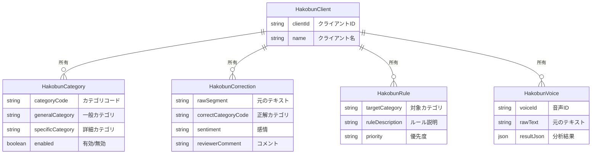
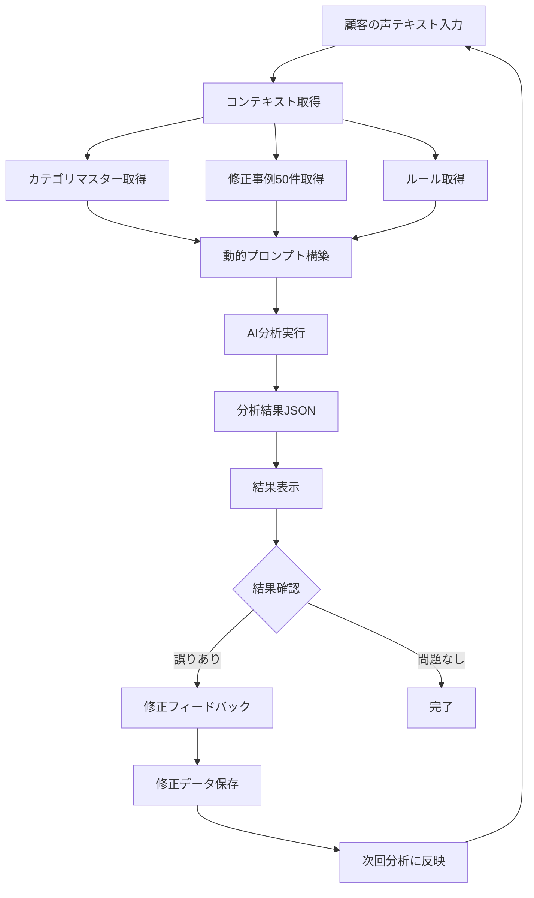
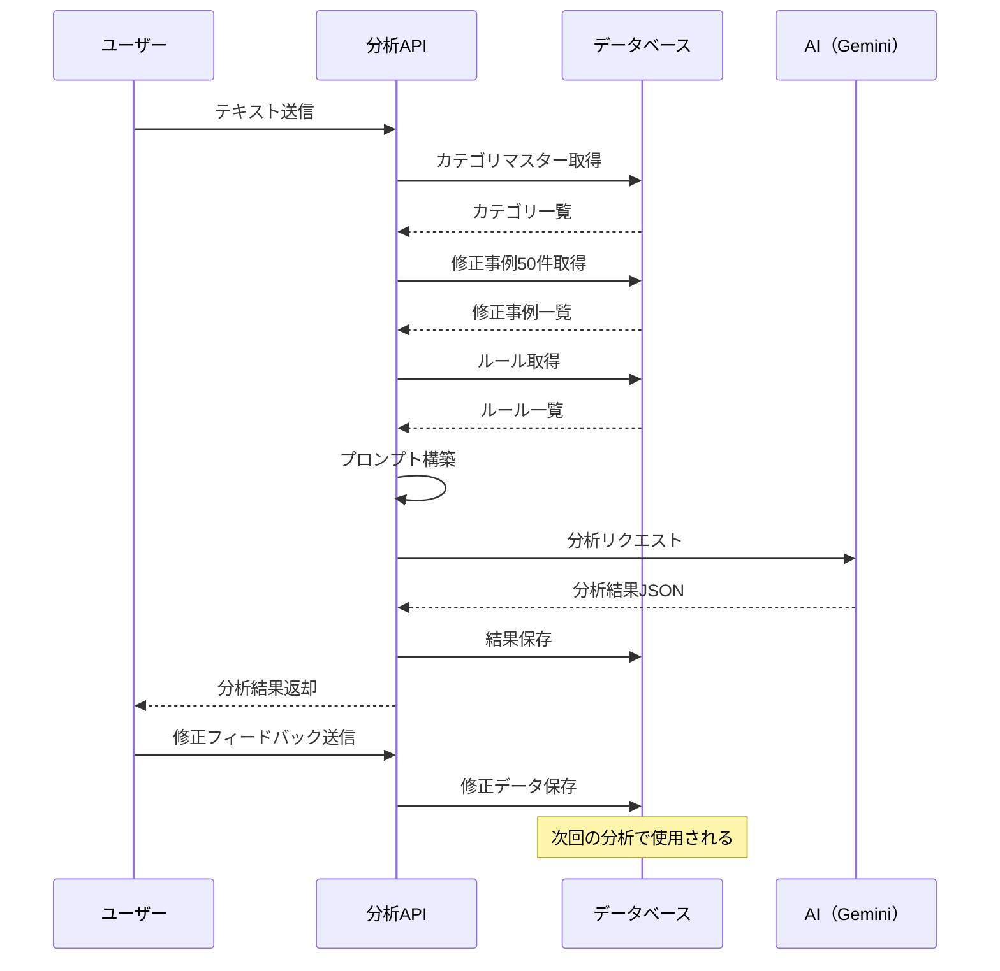
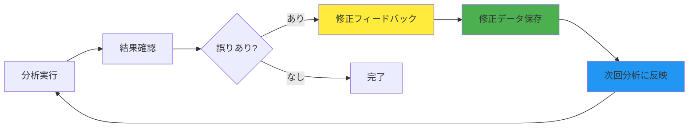
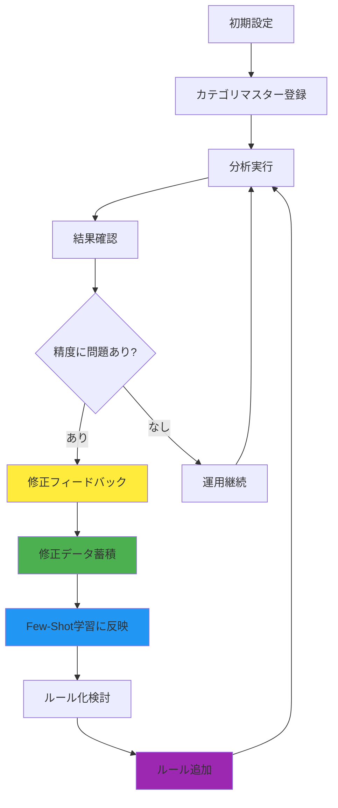

# 顧客の声分析システム（Hakobun Analysis）ご利用ガイド

## 目次

1. [システムの概要](#システムの概要)
2. [システムの仕組み](#システムの仕組み)
3. [データの流れ](#データの流れ)
4. [主な機能](#主な機能)
5. [分析結果の見方](#分析結果の見方)
6. [精度向上の仕組み](#精度向上の仕組み)

---

## システムの概要

本システムは、お客様からいただいたフィードバック（レビュー、アンケート、コメントなど）を自動的に分析し、構造化されたデータに変換するシステムです。

### 主な特徴

- **自動分析**: 生成AIを活用して、テキストを自動的にカテゴリ分類・感情分析
- **組織固有の分析**: 各組織の分析軸に合わせたカスタマイズが可能
- **継続的な改善**: 修正フィードバックを蓄積することで、分析精度が自動的に向上

### 分析できる内容

- **カテゴリ分類**: フィードバックの内容を適切なカテゴリに分類
- **感情分析**: 好意的、不満、リクエストの3種類で感情を判定
- **熱量スコア**: フィードバックの重要度を0〜100のスコアで評価
- **トピック分割**: 長文を意味のまとまりごとに分割して分析

---

## システムの仕組み

### 全体構成

システムは以下の4つの主要なデータベーステーブルで構成されています：



### 各テーブルの役割

#### 1. クライアント（HakobunClient）
分析対象となる組織を定義します。1つの組織が1つのクライアントとして登録されます。

#### 2. カテゴリマスター（HakobunCategory）
分析に使用するカテゴリの辞書です。組織ごとに独自のカテゴリを定義できます。

- **一般カテゴリ**: 大分類（例：店内、接客・サービス、料理・ドリンク）
- **詳細カテゴリ**: 具体的なカテゴリ名（例：オシャレ・雰囲気が良い、BGMが大きすぎる）

#### 3. 修正データペア（HakobunCorrection）
過去の分析結果に対する修正情報を保存します。AIの学習に使用されます。

- **元のテキスト**: 分析対象となったテキスト
- **正解カテゴリ**: 人間が修正した正しいカテゴリ
- **感情**: 正しい感情分類
- **コメント**: 修正理由（任意）

#### 4. ルール（HakobunRule）
AIの判断基準を明示的に定義したルールです。頻繁に発生する誤分類を防ぐために使用されます。

- **対象カテゴリ**: ルールが適用されるカテゴリ
- **ルール説明**: 具体的な判断基準
- **優先度**: High / Medium / Low

#### 5. 顧客の声（HakobunVoice）
分析結果を保存します。

- **元のテキスト**: 分析対象となったテキスト
- **分析結果**: 構造化されたJSONデータ

---

## データの流れ

### 分析プロセスの全体フロー



### 詳細な処理フロー



---

## 主な機能

### 1. テキスト分析

1件のテキストを分析し、構造化されたデータに変換します。

**入力**: 顧客の声テキスト（例：「ランチとは雰囲気が違うしよかったんですが、とにかく音楽がでかい！」）

**出力**: 構造化されたJSONデータ
- トピック単位に分割
- 各トピックにカテゴリ、感情、熱量スコアを付与

### 2. 一括分析

複数のテキストを一度に分析します。改行区切りで複数のテキストを入力できます。

**用途**:
- アンケート結果の一括分析
- レビューサイトのデータ分析
- 過去データの再分析

### 3. フィードバック機能

分析結果に誤りがある場合、修正してフィードバックを送信できます。

**修正可能な項目**:
- カテゴリ名
- 感情分類
- コメント（修正理由）

**効果**: 修正した内容は次回の分析から自動的に反映され、同じ誤りを防ぎます。

### 4. ルール自動作成

過去の修正事例から、ルールを自動生成する機能です。

**処理フロー**:
1. 修正事例を選択
2. AIが修正事例から共通パターンを抽出
3. ルール草案を生成
4. 承認後、ルールとして登録

---

## 分析結果の見方

### 分析結果の構造

分析結果は以下の形式で返されます：

```json
{
  "voice_id": "unique_id_001",
  "process_timestamp": "2025-01-15T10:00:00Z",
  "extracts": [
    {
      "raw_text": "元のテキスト全文",
      "sentence": "トピック単位のテキスト",
      "general_category": "店内",
      "category": "BGMが大きすぎる",
      "sentiment": "不満",
      "posi_nega": "negative",
      "magnitude": 75
    }
  ]
}
```

### 各項目の説明

- **voice_id**: 分析を識別する一意のID
- **process_timestamp**: 分析実行日時
- **extracts**: トピック単位の分析結果の配列
  - **raw_text**: 元のテキスト全文
  - **sentence**: トピック単位に分割されたテキスト
  - **general_category**: 一般カテゴリ（大分類）
  - **category**: 詳細カテゴリ
  - **sentiment**: 感情分類（好意的 / 不満 / リクエスト）
  - **posi_nega**: ポジネガ判定（positive / negative / neutral）
  - **magnitude**: 熱量スコア（0〜100）

### 統計情報

分析結果には以下の統計情報も含まれます：

- **感情別の集計**: 好意的、不満、リクエストの件数
- **平均熱量スコア**: 全トピックの熱量スコアの平均
- **カテゴリ別の集計**: カテゴリごとの出現回数

---

## 精度向上の仕組み

### 学習の仕組み

システムは、修正フィードバックを蓄積することで、分析精度を継続的に向上させます。



### Few-Shot学習

**仕組み**: 直近50件の修正事例を、AIのプロンプトに含めます。

**効果**:
- 同じパターンの誤りを即座に防ぐ
- 類似の言い回しでも正しく分類できる

**例**:
- 修正事例：「とにかく音楽がでかい！」→ カテゴリ「BGMが大きすぎる」
- 次回の類似テキスト：「音が大きすぎる」→ 同じカテゴリに分類される

### ルールによる精度向上

**仕組み**: 頻繁に発生する誤分類パターンをルールとして定義します。

**効果**:
- 明確な判断基準をAIに与える
- トークン数を節約しつつ、普遍的な判断基準を確立

**例**:
- ルール：「音響」「BGM」「空調」に関する記述は「店内（雰囲気）」ではなく「備品・設備」に分類すること
- 効果：このルールに該当するテキストは、確実に正しいカテゴリに分類される

### 継続的な改善サイクル



### 精度向上のポイント

1. **早期のフィードバック**: 誤りを発見したらすぐに修正フィードバックを送信
2. **一貫した修正**: 同じパターンの誤りは一貫して修正
3. **コメントの記入**: 修正理由を記入することで、将来のルール化に役立つ
4. **ルールの活用**: 頻繁に発生する誤分類はルールとして定義

---

## よくある質問

### Q1. 分析精度はどの程度ですか？

A. 初期状態では、カテゴリマスターの設定やテキストの特性によって精度が異なります。修正フィードバックを蓄積することで、継続的に精度が向上します。

### Q2. 修正フィードバックはどのくらい反映されますか？

A. 修正フィードバックは、次回の分析から即座に反映されます。直近50件の修正事例が自動的にAIの学習に使用されます。

### Q3. カテゴリは後から追加できますか？

A. はい、いつでも追加できます。カテゴリマスターに新しいカテゴリを登録すると、次回の分析から使用されます。

### Q4. 分析結果をエクスポートできますか？

A. 分析結果はJSON形式で返されます。必要に応じて、CSVやExcel形式に変換してご利用ください。

### Q5. 過去の分析結果を再分析できますか？

A. はい、一括分析機能を使用して、過去のテキストデータを再分析できます。

---

## まとめ

本システムは、顧客の声を自動的に分析し、構造化されたデータに変換するシステムです。修正フィードバックを蓄積することで、分析精度が継続的に向上し、組織固有の分析軸に合わせたカスタマイズが可能です。

ご不明な点がございましたら、お気軽にお問い合わせください。

