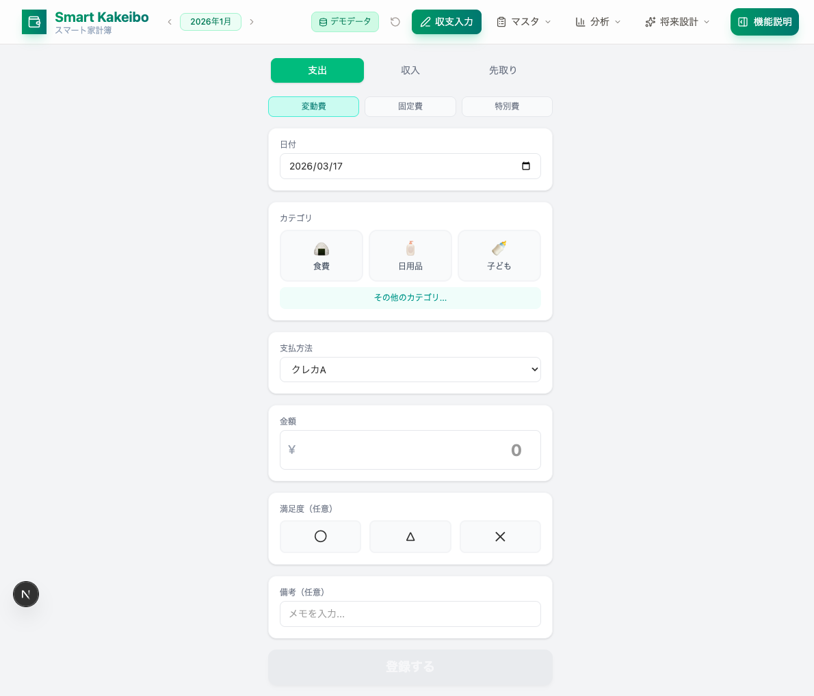
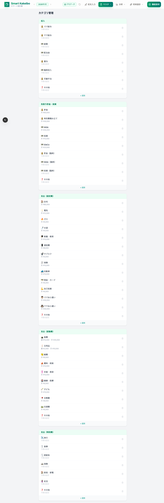
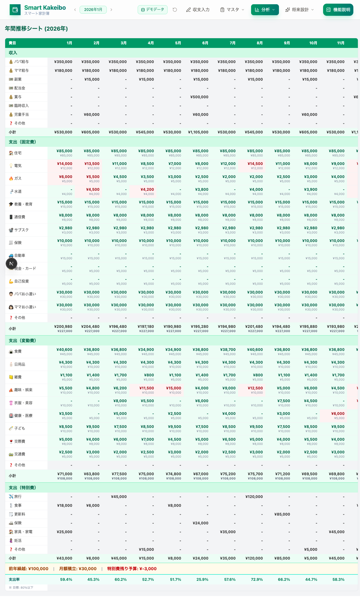
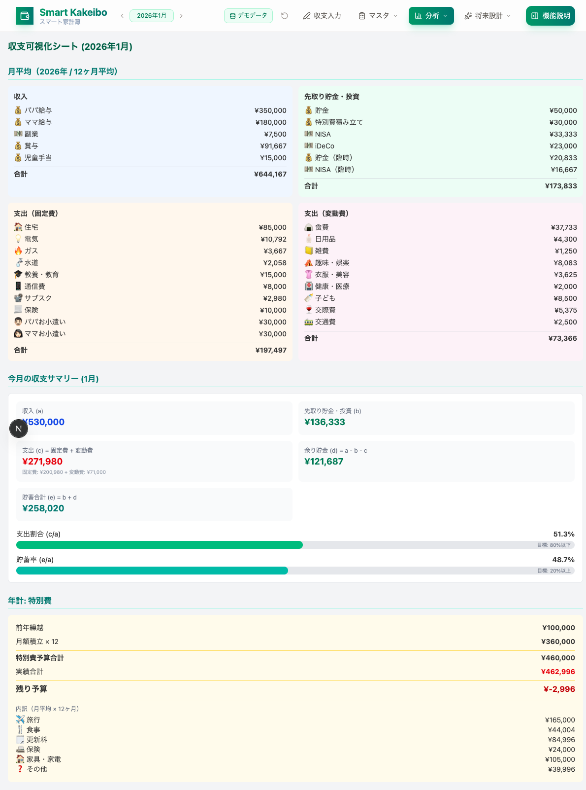
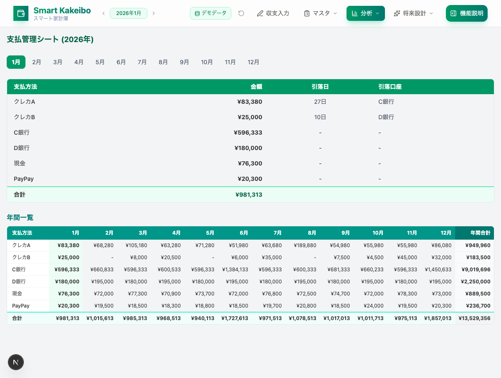
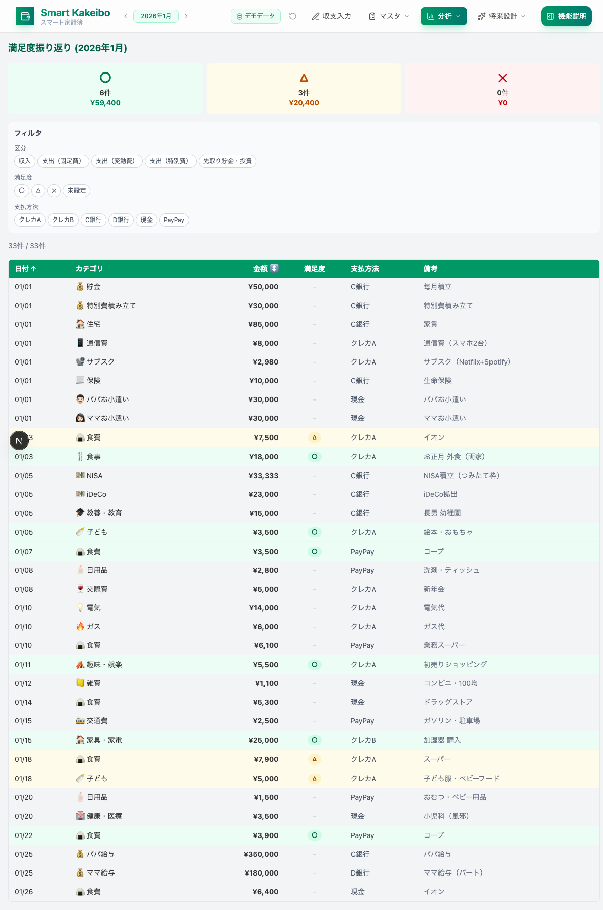
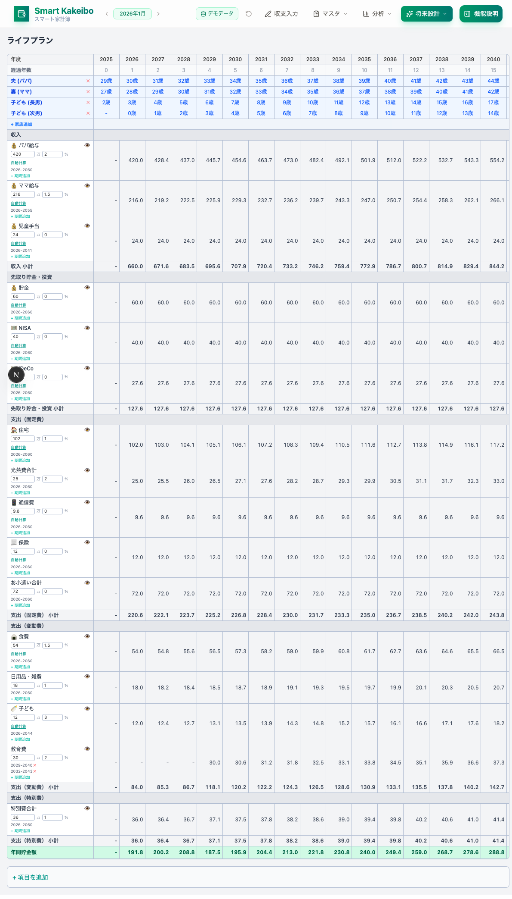
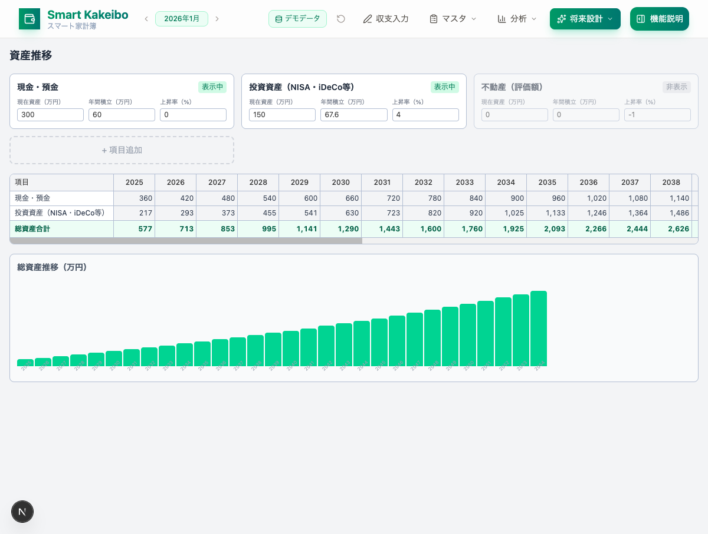

# スマート家計簿 ユーザーマニュアル

> 入力のしやすさを追求した家計簿アプリ。週予算・月予算管理、年間推移、収支可視化、ライフプランまで一元管理できます。

---

## 目次

1. [はじめに](#はじめに)
2. [画面構成](#画面構成)
3. [収支入力](#1-収支入力)
4. [マスタ管理](#2-マスタ管理)
5. [年間推移シート](#3-年間推移シート)
6. [収支可視化シート](#4-収支可視化シート)
7. [支払管理シート](#5-支払管理シート)
8. [満足度振り返り](#6-満足度振り返り)
9. [ライフプラン](#7-ライフプラン)
10. [資産推移](#8-資産推移)
11. [便利な機能](#便利な機能)
12. [よくある質問](#よくある質問)

---

## はじめに

スマート家計簿は、**「家計簿が続かない」を解決する**ために設計されたアプリです。

- よく使うカテゴリをワンタップで選択
- 入力後すぐに予算の残りを確認
- 月次・年次の収支を自動で可視化
- 将来のライフプランまでシミュレーション

### カテゴリの区分

本アプリでは、すべての収支を以下の5つの区分で管理します。

| 区分 | 説明 | 例 |
|------|------|------|
| 収入 | 給与・手当・副業など | パパ給与、ママ給与、児童手当 |
| 先取り貯金・投資 | 毎月先に取り分けるお金 | 貯金、NISA、iDeCo |
| 支出（固定費） | 毎月ほぼ一定の出費 | 家賃、電気、通信費、保険 |
| 支出（変動費） | 月によって変わる出費 | 食費、日用品、趣味、交際費 |
| 支出（特別費） | 不定期に発生する大きな出費 | 旅行、家具・家電、更新料 |

---

## 画面構成

アプリ上部のヘッダーから全機能にアクセスできます。

| メニュー | サブメニュー | 内容 |
|----------|-------------|------|
| 収支入力 | ー | 日々の収入・支出を記録 |
| マスタ | カテゴリ管理 | カテゴリの追加・編集・予算設定 |
| マスタ | 支払方法管理 | 支払方法の追加・編集 |
| 分析 | 年間推移 | 12ヶ月分の費目別推移テーブル |
| 分析 | 収支可視化 | 月平均と今月のサマリー |
| 分析 | 支払管理 | 支払方法別の集計 |
| 分析 | 満足度振り返り | 購入品の満足度を分析 |
| 将来設計 | ライフプラン | 30年分の収支シミュレーション |
| 将来設計 | 資産推移 | 資産の将来推移を試算 |

ヘッダー左の **< 2026年1月 >** で表示する年月を切り替えられます。

---

## 1. 収支入力

日々の収入・支出を記録する画面です。



### 入力手順

1. **区分を選択** — 上部タブで「支出」「収入」「先取り」を切り替えます。支出の場合はさらに「変動費」「固定費」「特別費」から選びます。
2. **日付を確認** — 今日の日付が自動で入ります。変更したい場合はカレンダーから選択してください。
3. **カテゴリを選択** — よく使う上位3件がボタンで表示されます。該当しない場合は「その他のカテゴリ...」をタップしてプルダウンから選びます。
4. **支払方法を選択** — クレジットカード、銀行、現金、PayPay などから選択します。
5. **金額を入力** — 金額を数字で入力します（必須）。
6. **満足度を選択（任意）** — この買い物の満足度を「〇（満足）」「△（普通）」「✕（不満足）」から選べます。月末の振り返りに活用できます。
7. **備考を入力（任意）** — 「スーパー」「電車代」など自由にメモを残せます。
8. **「登録する」をタップ** — 登録完了です。

### 予算残ポップアップ

登録後、該当カテゴリに予算が設定されている場合、**週予算と月予算の残り**がポップアップで表示されます。

- 緑色 → 予算内です
- 赤色 → 予算を超過しています

ポップアップは3秒で自動的に消えます。タップしても閉じられます。

---

## 2. マスタ管理

カテゴリと支払方法を管理する画面です。



### カテゴリ管理

- カテゴリは5つの区分（収入、先取り、固定費、変動費、特別費）ごとにグループ分けして表示されます
- 各カテゴリには **月予算** と **週予算** を設定できます（変動費は週予算も設定推奨）
- カテゴリ名をタップすると、名称・予算をインラインで編集できます
- 「+ 追加」ボタンで新しいカテゴリを追加できます
- ゴミ箱アイコンで削除（確認ダイアログあり）

### 支払方法管理

- 支払方法の名称、引落日、引落口座を管理します
- クレジットカードには引落日と引落口座を設定しておくと、支払管理シートで自動表示されます

---

## 3. 年間推移シート

1年分の収支を費目×月のテーブルで一覧表示する画面です。



### 見方

- **行**: 費目が区分（収入→固定費→変動費→特別費）ごとにグループ化されています
- **列**: 1月〜12月 + 平均 + 年間合計
- **各セル**: 上段に**実績**（太字）、下段に**予算**（小さい字）を表示

### 色の判定

| 色 | 意味 |
|----|------|
| 緑の背景 | 実績が予算以内 |
| 赤の背景 | 実績が予算を超過 |
| 色なし | 予算未設定 |

### 特別費セクション

画面下部に特別費の管理情報が表示されます。

- **前年繰越**: 前年から持ち越した特別費の残り
- **月額積立**: 毎月の特別費積み立て額
- **特別費残り予算**: 繰越 + 積立合計 - 実績合計

### 支出率

最下部に **支出率**（支出合計 ÷ 収入合計 × 100）が表示されます。目標は **80%以下** です。

---

## 4. 収支可視化シート

月平均の収支バランスと今月のサマリーを表示する画面です。



### 月平均セクション

1年分のデータから月平均を計算し、4つのグループに分けて表示します。

| グループ | 内容 |
|----------|------|
| 収入 | 給与・手当などの月平均 |
| 先取り貯金・投資 | 毎月の積立の月平均 |
| 支出（固定費） | 家賃・光熱費などの月平均 |
| 支出（変動費） | 食費・日用品などの月平均 |

### 今月の収支サマリー

以下の計算式で家計の健全性がわかります。

| 項目 | 計算式 |
|------|--------|
| 収入 (a) | 収入合計 |
| 先取り貯金・投資 (b) | 先取り合計 |
| 支出 (c) | 固定費 + 変動費 |
| 余り貯金 (d) | a - b - c |
| 貯蓄合計 (e) | b + d |
| **支出割合** | c ÷ a × 100（目標: 80%以下） |
| **貯蓄率** | e ÷ a × 100（目標: 20%以上） |

プログレスバーで目標達成状況が一目でわかります。

### 年計: 特別費

年間の特別費の予算と実績のサマリーが表示されます。

---

## 5. 支払管理シート

支払方法別の月次集計を確認する画面です。



### 月別テーブル

上部のタブ（1月〜12月）で月を切り替え、各支払方法の金額・引落日・引落口座を確認できます。

月の合計金額も表示されるため、**口座残高が十分か事前にチェック**するのに役立ちます。

### 年間一覧

下部のテーブルでは、支払方法×12ヶ月の一覧を横スクロールで確認できます。年間合計も表示されます。

---

## 6. 満足度振り返り

月ごとの購入品を満足度の観点から振り返る画面です。



### 満足度サマリー

画面上部に、満足度ごとの件数と金額が色分けで表示されます。

| 満足度 | 色 | 意味 |
|--------|-----|------|
| 〇 | 緑 | 買ってよかった |
| △ | 黄 | まあまあ |
| ✕ | 赤 | 無駄だった |

### フィルタ機能

以下の条件でデータを絞り込めます。

- **区分**: 収入、固定費、変動費、特別費、先取り
- **満足度**: 〇、△、✕、未設定
- **支払方法**: クレカA、クレカB、銀行、現金、PayPay

### ソート

テーブルのヘッダー「日付」「金額」をクリックすると、昇順・降順を切り替えられます。

### 活用のポイント

- 月末に「✕（不満足）」の項目を見返して、来月の節約ポイントを見つけましょう
- 「〇（満足）」が多いカテゴリには予算を増やすのも賢い選択です

---

## 7. ライフプラン

30年分の収支をシミュレーションする画面です。



### 家族年齢推移

テーブル上部に家族メンバーの年齢が年ごとに表示されます。

- 「+ 家族追加」で家族を追加できます
- 「×」で削除できます

### 収支シミュレーション

各カテゴリの行に以下を設定します。

| 設定項目 | 説明 |
|----------|------|
| 初期値（万円） | 最初の年の金額 |
| 上昇率（%） | 年ごとの増加率（例: 食費は1.5%/年） |
| 算定期間 | いつからいつまで計算するか（複数期間設定可） |

### 自動計算ボタン

「自動計算」ボタンを押すと、**家計簿の入力データの平均値 × 12ヶ月** を初期値に自動セットします。手動で入力する手間が省けます。

### 年間貯金額

最下段に **年間貯金額 = 収入合計 - 支出合計** が表示されます。

- 緑背景 → 黒字（貯金できている年）
- 赤背景 → 赤字（支出が収入を上回る年）

### 項目の表示/非表示

目のアイコンで各項目の表示・非表示を切り替えられます。非表示にした項目は画面下部に表示され、いつでも戻せます。

### 項目の追加

「+ 項目を追加」ボタンで、既存カテゴリにない独自の項目（例: 大学費用）を追加できます。

---

## 8. 資産推移

30年分の資産残高をシミュレーションする画面です。



### 資産項目の設定

画面上部のカードで各資産項目を設定します。

| 設定項目 | 説明 |
|----------|------|
| 現在資産（万円） | 今の資産残高 |
| 年間積立（万円） | 毎年追加する金額 |
| 上昇率（%） | 年間の運用利回り（投資の場合4%など） |

初期設定では以下の3項目が用意されています。

| 項目 | 上昇率 | 説明 |
|------|--------|------|
| 現金・預金 | 0% | 銀行預金など |
| 投資資産（NISA・iDeCo等） | 4% | インデックス投資など |
| 不動産（評価額） | -1% | 保有不動産の評価額推移 |

### 推移テーブル

各年の資産額が横スクロールで確認できます。計算式:

```
翌年の資産 = 今年の資産 × (1 + 上昇率) + 年間積立
```

### 総資産推移グラフ

下部にバーチャートで総資産の推移が視覚的に表示されます。

### 項目の追加

「+ 項目追加」ボタンで、暗号資産や個別株など独自の資産項目を追加できます。

---

## 便利な機能

### デモデータ投入

ヘッダーの「デモデータ」ボタンをクリックすると、12ヶ月分のサンプルデータが投入されます。アプリの機能を一通り試したいときに便利です。

### 初期値に戻す

ヘッダーの回転矢印（↻）ボタンで、すべてのデータを初期状態に戻せます。

### 年月の切り替え

ヘッダー左の **< > ボタン** で表示月を前後に移動できます。分析画面やフィルタが自動的に選択月のデータに切り替わります。

### データの保存

入力したデータはブラウザ内に自動保存されます。ページを閉じても次回アクセス時にデータが復元されます。

---

## よくある質問

### Q. データはどこに保存されますか？

A. ブラウザの `localStorage` に保存されます。同じブラウザ・同じデバイスでアクセスすればデータは維持されます。ブラウザのキャッシュをクリアするとデータは消えますのでご注意ください。

### Q. 予算を設定するにはどうすればいいですか？

A. 「マスタ > カテゴリ管理」画面で、各カテゴリをタップすると予算を編集できます。変動費には **週予算** と **月予算** の両方を設定することをおすすめします。

### Q. 満足度は必ず入力しないといけませんか？

A. いいえ、任意です。ただし入力しておくと「満足度振り返り」画面で月末の振り返りに役立ちます。

### Q. ライフプランの「自動計算」は何を計算していますか？

A. 家計簿に入力された1年分のデータから月平均を計算し、× 12ヶ月して年間値（万円）を初期値にセットします。

### Q. 特別費の予算が足りなくなったらどうなりますか？

A. 収支可視化シートの「年計: 特別費」セクションで残り予算がマイナスで表示されます。年間推移シートの特別費セクションでも確認できます。
